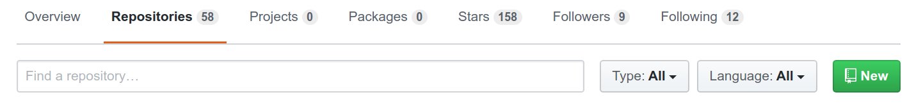
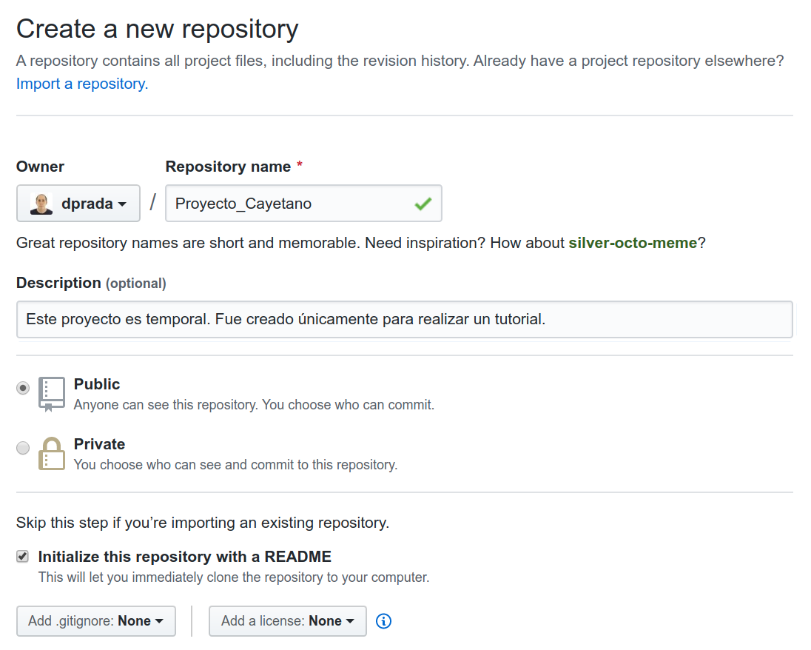
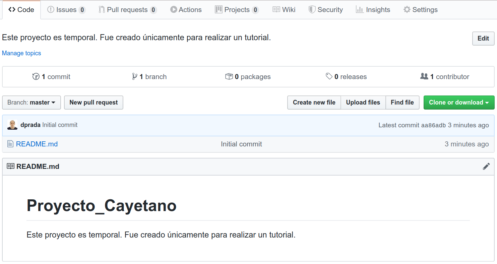

<p style="text-align:left;">
   <a href="../README.md">Ir al menú anterior</a>
   <span style="float:right;">
        <a href="../README.md">Ir a la unidad anterior</a>
   </span>
</p>

-----

- [Dudas, problemas técnicos y soluciones](#dudas)
- [Más recursos útiles](#recursos)
    - [Documentación](#documentacion)
    - [Tutoriales, Webinars y cursos gratuitos](#tutoriales)

# Cómo crear un repositorio en GitHub

Vamos a crear los pasos para crear un repositorio remoto en GitHub con su clon local en nuestra
computadora. Debes tener una cuenta en dicho servidor, si no la tienes y no conoces GitHub puede ser buen
momento para echarle un ojo a [la unidad de Academia de introducción a este servidor de alojamiento
en la nube de proyectos de desarrollo de software mediante git](../../Introducción/GitHub.md).

## El repositorio remoto en GitHub

Accede a la web pública de tu perfil de usuario y localiza el enlace al listado de tus
repositorios. Para ello puedes hacer click en la etiqueta "Repositories" que aparece en la imagen siguiente:



Haz click ahora en el botón verde que dice "New", esto te llevará a implementar los datos del nuevo
repositorio que pretendemos crear. En este caso el proyecto se llamará "Proyecto_Cayetano" y
requiero que sea público y que tenga un fichero README.md para comenzar. En cuanto al fichero
`.gitignore`, así como sobre la posibilidad de añadir una licencia, encontraremos información al
final de este documento.



Ya podemos acceder a la página web principal del repositorio "Proyecto_Cayetano":



## El clon del repositorio en tu computadora

Es momento ahora de clonar este repositorio en tu computadora. Para ello usaremos `git`. Si es la primera vez que te acercas
al uso de git te sugiero que revises [la unidad de Academia dedicada a presentar esta herramienta](../../Introducción/Git.md).

Abre una terminal en tu computadora y allá donde quieras ubicar la carpeta de tu clon local
ejecuta el siguiente comando (donde `dprada` debe sustituirse por el nombre de tu usuario en GitHub):

```bash
git clone git@github.com:dprada/Proyecto_Cayetano.git
```

Si se ejecutó correctamente verás un mensaje de salida como el siguiente. En caso de que no
sucediera esto, es posible que sea la primera vez que interaccionas con tu cuenta remota de GitHub
desde tu computadora. Debes realizar correctamente la configuración de tu entorno de trabajo
instalando git y configurando el acceso a GitHub como se indica [aquí](../../Introducción/Git.md) y [aquí](../../Introducción/GitHub.md). Si tienes algún otro problema adicional puedes consultar las dos entradas en el tablón de asuntos abiertas a modo de fóro técnico para [Git](https://github.com/uibcdf/Academia/issues/1) y [GitHub](https://github.com/uibcdf/Academia/issues/3).

```
Cloning into 'Proyecto_Cayetano'...
remote: Enumerating objects: 3, done.
remote: Counting objects: 100% (3/3), done.
remote: Compressing objects: 100% (2/2), done.
Receiving objects: 100% (3/3), done.
remote: Total 3 (delta 0), reused 0 (delta 0), pack-reused 0
```

Ya puedes entrar en el clon local de tu proyecto, hacer modificaciones, comprometerlas (`commit`) y
empujarlas a tu repositorio remoto (`push`).

``` bash
cd Proyecto_Cayetano
```

Ejecuta por ejemplo los siguientes comandos y acude a la web de tu repositorio en GitHub de
"Proyecto_Cayetano" para ver su efecto:

``` bash
echo "Más información sobre cómo fue creado en la [documentación del tutorial correspondiente en UIBCDF/Academia](https://github.com/uibcdf/Academia/Flujo_de_trabajo/Creando_GitHub_Repo/creando_github_repo.md") >> README.md
git commit -a -c "Primera modificación hecha en el clon local"
git push
```

## El fichero `.gitignore`

Bla, bla

## La licencia

Bla, bla


---

## Dudas, problemas técnicos y soluciones. <a class="anchor" id="dudas"></a>

Para centralizar esas dudas, sugerencias o soluciones técnicas sobre el tema de este notebook, haz uso del siguiente canal:

[Foro Técnico: X][foro]

## Más recursos útiles <a class="anchor" id="recursos"></a>

Esto era sólo una guia introductoria. No es funcional documentarse o estudiar mucho sin antes comenzar a usar el sistema operativo Linux. Aprenderás de manera más solida si con el uso te van surgiendo necesidades a las que vas dando solución poco a poco. Si la computadora es tu herramienta de trabajo, es tu deber conocerla. Puedes encontrar -o contribuir añadiendo- más información útil en el siguiente listado.

### Documentación <a class="anchor" id="documentacion"></a>

### Tutoriales, Webinars y cursos gratuitos <a class="anchor" id="tutoriales"></a>

<br>

<div style='text-align: right;'> <a href="../Implementando/Implementando.md">Ir a la siguiente unidad</a> </div>

-------
<p xmlns:cc="http://creativecommons.org/ns#" xmlns:dct="http://purl.org/dc/terms/"><a property="dct:title" rel="cc:attributionURL" href="https://github.com/uibcdf/Academia">UIBCDF-Academia</a> por <a rel="cc:attributionURL dct:creator" property="cc:attributionName" href="https://github.com/uibcdf/Academia/graphs/contributors">UIBCDF Lab, autores y colaboradores</a> es material protegido bajo una licencia <a href="http://creativecommons.org/licenses/by-nc-sa/4.0/deed.es?ref=chooser-v1" target="_blank" rel="license noopener noreferrer" style="display:inline-block;">Attribution-NonCommercial-ShareAlike 4.0 International</a></p>

[foro]: https://github.com/uibcdf/Academia/issues/x

