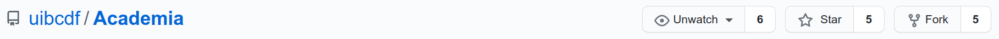
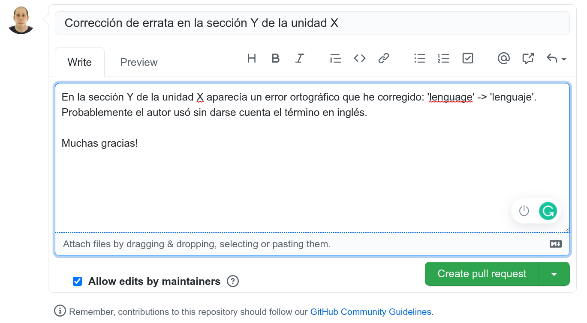
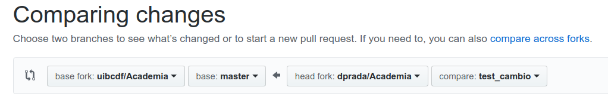
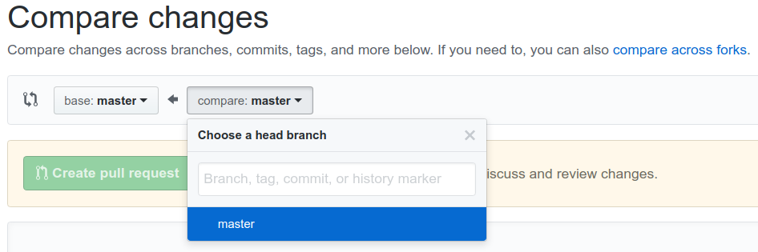

<p style="text-align:left;">
   <a href="../README.md">Ir al menú anterior</a>
   <span style="float:right;">
        <a href="../Que_es/Que_es.md">Unidad anterior</a>
   </span>
</p>

-----

<br>
<center>

</center>
<br>


# Cómo contribuir a desarrollar UIBCDF-Academia.

<div class="alert alert-info" role="alert">
<strong>Info:</strong> Si crees que este notebook necesita algún cambio no dudes en <a href="Como_contribuir.md" class="alert-link">contribuir a su desarrollo</a>.
</div>

<div class="alert alert-warning" role="alert">
<strong>Atención:</strong> Cualquier contribución que hagas al contenido UIBCDF-Academia queda
protegido bajo una licencia <a href="http://creativecommons.org/licenses/by-nc-sa/4.0/deed.es?ref=chooser-v1" target="_blank" rel="license noopener noreferrer" style="display:inline-block;">Creative Commons Attribution-NonCommercial-ShareAlike 4.0 International</a>.
</div>

<div class="alert alert-danger" role="alert">
<strong>En desarrollo:</strong> 20%.
</div>

<br>

Sería muy positivo para el repositorio que nos ayudaras a mejorarlo incluyendo aquellas cuestiones
que has echado de menos o consideras que necesitan ser corregidas. Si no tienes mucha experiencia
en el trabajo computacional en colaboración, puedes tomarte este repositorio como una primera
experiencia que te ayudará a entender algunas de las herramientas y dinámicas empleadas para el
desarrollo de un proyecto en grupo. Para ello, en esta unidad encontrarás todo lo que debes conocer para comenzar a contribuir
en UIBCDF-Academia haciendo uso de
[Git](../../Laboratorio_computacional/Herramientas/Control_versiones_distribuida/Git/Git.md) y [GitHub](../../Laboratorio_computacional/Herramientas/Control_versiones_distribuida/GitHub/GitHub.md).

- [Cualquier contribución queda sometida a los términos de la licencia](#Cualquier-contribución-queda-sometida-a-los-términos-de-la-licencia)
- [Implementa los cambios sobre tu propio fork](#Implementa-los-cambios-sobre-tu-propio-fork)

## Cualquier contribución queda sometida a los términos de la licencia

Antes de comenzar con la descripción de los pasos que debes dar para contribuir al desarrollo de
UIBCDF-Academia, debes saber que toda modificación o inclusión de nuevo contenido que hagas por tu
parte será, una vez incluido en el repositorio principal de UIBCDF-Academia, sometido y protegido
por las condiciones de la licencia Creative Commons Attribution-NonCommercial-ShareAlike 4.0
International misma que cubre todo el contenido de UIBCDF-Academia. Es tu responsibilidad como
colaborador haber revisado [las condiciones de la licencia](../La_licencia/La_licencia.md) antes de publicar tu contribución.

## Implementa los cambios sobre tu propio fork

Para poder hacer una solicitud de inclusión de tus cambios deberás implementar estos en tu propio 'fork' (derivación del proyecto) en GitHub. ¿Que es un fork de UIBCDF-Academia? ¿Cúal es la diferencia con un clon? Bueno, brevemente debes saber que clon y fork no son conceptos excluyentes. De hecho, para incorporar los cambios trabajarás con un clon ubicado en tu computadora de tu fork de UIBCDF-Academia. Si no estás familiarizad con estos términos, como primera aproximación debes saber que:

- Llamaremos "clon" es la copia "cuyo desarrollo no será independiente" de un repositorio. El clon mantiene su vínculo
  con el original de tal manera que son imágenes del mismo proyecto y como tal pueden en cualquier
  momento compararse y sincronizarse mediante los comandos de git "push" (si vas a traer los
  cambios sobre el clon) y "pull" (si vas a empujar los cambios desde el clon).
- Llamaremos "fork" a la copia "cuyo desarrollo será independiente" de un repositorio. El fork se ubicará en la cartera de
  proyectos de tu usuario en GitHub. Y como fork, los comandos push y pull no bastan para
  sincronizar el contenido del fork con el original, debe hacerse una petición de incorporación
  de cambios a los administradores del original -conocida en inglés como **Pull Request (PR)**-.

<div class="alert alert-success" role="alert">
<strong>Ayuda:</strong> Puedes encontrar más información sobre qué es un "fork" y cúal es la diferencia con un clon en los siguientes enlaces:
<a href='https://help.github.com/articles/fork-a-repo/'>aquí</a>, <a href='https://github.community/t5/Support-Protips/The-difference-between-forking-and-cloning-a-repository/ba-p/1372'>aquí</a>, <a href='https://stackoverflow.com/questions/6286571/are-git-forks-actually-git-clones'>aquí</a> o <a href='http://www.eqqon.com/index.php/Collaborative_Github_Workflow'>aquí</a>. Además puedes acudir a <a href='../../Laboratorio_computacional/Herramientas/Control_versiones_distribuida/README.md'>las unidades de UIBCDF-Academia dedicadas a las herramientas de control de versiones distribuida como Git y GitHub</a>.
</div>

Para hacer tu fork, habiendo iniciado sesión con tu usuario en GitHub, acude a [la web del repositorio principal de UIBCDF-Academia en GitHub](https://github.com/uibcdf/Academia) y haz click en 'fork'.

<br>
<center>

</center>
<br>

Ya puedes acudir a tu página de GitHub y encontrar UIBCDF-Academia entre tus repositorios. Ahora, para hacer un clon local de tu fork de UIBCDF-Academia. Sustituye en el siguiente comando 'tu-nombre' por tu nombre de usuario en GitHub, y ejecútalo en una terminal de la computadora con la que vas a trabajar sobre el directorio en el que quieras ubicarlo, en mi caso mi carpeta '~/Projects':

```bash
cd ~/Projects
git clone git@github.com:tu-nombre/Academia.git
```

Tu 'fork' de Academia, y su clon local en tu computadora, te van a permitir jugar y cambiar cosas sin alterar el repositorio central. Puedes hacer lo que quieras en ellos. Una buena manera de proceder sería, dejar la rama principal, llamada *main*, de tu 'fork' como espejo del repositorio central y crear ramas (*branches*) para jugar con el repositorio y hacer modificaciones. Puedes solicitar incluir tus modificaciones en el repositorio principal de UIBCDF-Academia desde cualquier de las ramas de tu fork -como verás más adelante-.

Pero espera, vaya, que ahora hemos usado un término al que probablemente no estabas habituado. ¿Qué
es una rama (*branch*) de tu repositorio? En realidad un proyecto gestionado por Git se compone de
ramas, es posible que hasta ahora no supieras de su existencia porque tu proyecto tiene únicamente
una que por defecto suele llamarse "master" o "main". Para que comprendas el concepto de rama,
vamos a imaginar una situación hipotética descrita en la siguiente secuencia:

- Es martes y has trabajado en tu proyecto. Ya casi lo tienes. Debe estar listo para el viernes. Pero como siempre pasa,
  acabas de tener una idea que no sabes todavía si te convence del todo. Implementarla supone
  modificar muchas cosas... es arriesgado porque puede que tanta modificación arruine la versión
  del proyecto que ya tienes. Sin mucho pensar, decides ser valiente y comenzar a editar los
  archivos. Nooo! espera, dejalo como estaba, haz uso de un controlador de versiones como Git.
- Defines primero la carpeta principal donde tienes los archivos con los que estás trabajando como
  proyecto "seguido o administrado" por Git. Lo que ahora mismo tienes se registrará como rama
  principal llamada probablemente "master" (o "main").
- Ahora crea una rama que llamaremos aquí "modificación A". Dile a git que quieres saltar a la
  nueva rama, y comienza a implemtar modificaciones.
- Ya es miércoles y no te gusta como está quedando. Se te ocurre que podías haber comenzado a
  modificar lo del martes de otra manera. No te preocupes. Dile a git que quieres hacer una nueva
  rama que llamaremos "modificación B" a imagen y semejanza de la rama "master" -que no tiene
  cambios desde el martes-. Saltas a la nueva rama "modificación B" y comienzas de nuevo incluir
  modificaciones.
- Es jueves, ya no sabes qué opción quedó mejor, "modificación A" o "modificación B". Con Git
  puedes saltar de una a otra, seguir desarrollandolas independientemente.
- Por fín es viernes. Claramente la versión de la rama "modificación B" quedó mejor que como estaba
  el proyecto el martes, y mejor también que la versión de la rama "modificación A".
- Pídele a Git que compare la rama "master" con "modificación B" y sincronice la primera con la
  segunda, implementando los cambios (las diferencias). Ya puedes borrar si quieres la rama
  "modificación B". Evidentemente también deberías borrar, si quieres, la rama "modificación A".
- Por último, si es que tenías un clon remoto y principal de tu proyecto en GitHub, sincroniza tu
  rama "master" del clon en GitHub con tu "master" del clon local de tu computadora empujando los
  cambios con el comando de Git "pull" (desde tu clon local al clon remoto en GitHub).

<div class="alert alert-success" role="alert">
<strong>Ayuda:</strong> Puedes encontrar más información sobre cómo trabajar con las ramas de Git en <a href='../../Laboratorio_computacional/Herramientas/Control_versiones_distribuida/README.md'>la unidad dedicada en UIBCDF-Academia a esta herramienta</a>.
</div>

## Implementando cambios en el repositorio central

Supongamos que has detectado un error en una unidad y lo quieres corregir, o consideras que una explicación no es clara, o quieres añadir un párrafo, o conoces documentación o tutoriales que quieres compartir en la sección de la unidad dedicada enlistar otras fuentes útiles de información. Edita lo que quieras localmente en el fichero de tu fork, o del clon de tu fork, y cuando consideres que está listo reinicialo y ejecútalo de principio a fin. Compromete los cambios en tu rama. Súbe estos cambios al clon principal de tu fork en GitHub -si estabas trabajando con un clon local en tu computadora-, y haz una solicitud de incorporación de cambios, *Pull Request* (o PR en la jerga de Git), en el repositorio original de UIBCDF-Academia. Veamos este proceso paso a paso.

### Creación de una rama para realizar las modificaciones

Como habíamos anticipado anteriormente, la forma más limpia de realizar una contribución sería
proponerla desde una rama diferente a la principal de tu fork. En primer lugar, asegúrate de que 

### Si no tienes permisos de edición

En este caso lo más probable es que hayas decidido hacer tu propio fork del repositorio. En ese caso puedes recurrir a la página web de github de tu fork, o puedes solicitar el 'Pull Request' haciendo uso de la 
[web del repositorio de academia](https://github.com/uibcdf/Academia).

Antes, asegurate de ciertas cosas. Si has estado jugando con tu fork de Academia necesitamos que los cambios relativos a tus pruebas de aprendizaje no estén entre la lista de modificaciones que vas a compartir. 
Es muy conveniente que hayas estado jugando en una rama creada para tal propósito, o que si has estado modificando 'master' deshagas los cambios que no quieres compartir. Si tienes el 'master' limpio y actualiza
do, te sugerimos que hagas una nueva rama y la empujes a tu fork central de GitHub.

Con el `master` del clon local de tu fork limpio crea una rama para tu modificación o modificaciones:

```bash
git checkout -b nombre_de_la_rama # usa un nombre que la identifique
```

Ahora empuja tu rama a tu repositorio del fork:

```bash
git push origin nombre_de_la_rama
```

Ya puedes en local hacer los cambios que quieres subir y comprometerlos en esa rama:

```bash
git commit -a -m 'descripción breve de cambios'
git push origin nombre_de_la_rama
```

Para despues hacer el 'Pull Request' haciendo uso de la [web del repositorio de academia](https://github.com/uibcdf/Academia). Haz click en 'New Pull Request':


<br>
<center>

</center>
<br>

Haz click entonces la opción 'compare across forks' en el botón derecho para su comparación con el `master`, y elige tu repositorio y la rama que quieres fusionar con el `master` del repositorio original de Academia:

<br>
<center>

</center>
<br>

Documenta tu PR dando un poco de información sobre los cambios que has realizado para que podamos discutir su aceptación. Tu solicitud será revisada y evaluada por todos su aprobación.

Puedes tener un poco más información sobre este proceso [aquí](https://help.github.com/articles/creating-a-pull-request/).

### Si tienes permisos de edición

En este caso, si optaste por hacer un 'fork' del repositorio central en tu usuario, la sección anterior describe el procedimiento más adecuado para hacer un 'Pull Request' (PR en la jerga de Git).

Si en lugar de eso hiciste un clon del repositorio de Academia en el grupo UIBCDF de Github y has estado jugando con tu clon local necesitamos que los cambios relativos a tus pruebas no estén entre la lista de modificaciones que vas a compartir. Deshaz los cambios, pídele a git que vuelva a la versión original, o directamente haz un nuevo clon donde tu quieras:

```bash
cd ~/Projects/
git clone git@github.com:uibcdf/Academia Academia_limpia
cd Academia_limpia
```

Con el clon limpio crea una rama para tu modificación o modificaciones:

```bash
git checkout -b nombre_de_la_rama # usa un nombre que la identifique
```

Ahora empuja tu rama al repositorio central:

```bash
git push origin nombre_de_la_rama
```

Ya puedes en local hacer los cambios que quieres subir y comprometerlos en esa rama:

```bash
git commit -a -m 'descripción breve de cambios'
git push origin nombre_de_la_rama
```

Para despues hacer el 'Pull Request' haciendo uso de la [web del repositorio de academia](https://github.com/uibcdf/Academia). Haz click en 'New Pull Request':

<br>
<center>

</center>
<br>

Elige entonces tu rama en el botón derecho para su comparación con el `master`:

<br>
<center>

</center>
<br>

Documenta tu PR dando un poco de información sobre los cambios que has realizado, para su aceptación.
Tu solicitud será vista y discutida por todos hasta su aprobación.

Puedes tener un poco más información sobre este proceso [aquí](https://yangsu.github.io/pull-request-tutorial/) o [aquí](https://help.github.com/articles/creating-a-pull-request/).

#### Ayuda

En caso de que necesites más información a propósito de cómo implementar cambios o interaccionar con el repositorio remoto, puedes visitar la unidad de [introducción a GitHub](GitHub.ipynb). Si has tenido algún problema técnico puedes compartirlo con nosotros en [el foro de GitHub del panel de este repositorio](https://github.com/uibcdf/Academia/issues/3), allí centralizamos los problemas y soluciones para que la experiencia se acumule de manera visible para todos.


<br />

<div style='text-align: right;'> <a href="../La_licencia/La_licencia.md">Siguiente unidad</a> </div>

-------
<p xmlns:cc="http://creativecommons.org/ns#" xmlns:dct="http://purl.org/dc/terms/"><a property="dct:title" rel="cc:attributionURL" href="https://github.com/uibcdf/Academia">UIBCDF-Academia</a> por <a rel="cc:attributionURL dct:creator" property="cc:attributionName" href="https://github.com/uibcdf/Academia/graphs/contributors">UIBCDF Lab, autores y colaboradores</a> es material protegido bajo una licencia <a href="http://creativecommons.org/licenses/by-nc-sa/4.0/deed.es?ref=chooser-v1" target="_blank" rel="license noopener noreferrer" style="display:inline-block;">Attribution-NonCommercial-ShareAlike 4.0 International</a></p>

