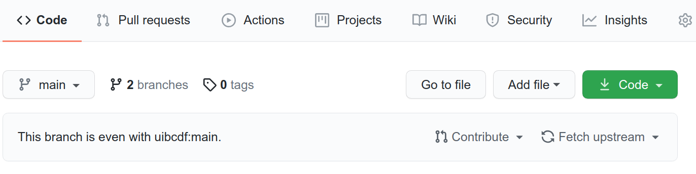
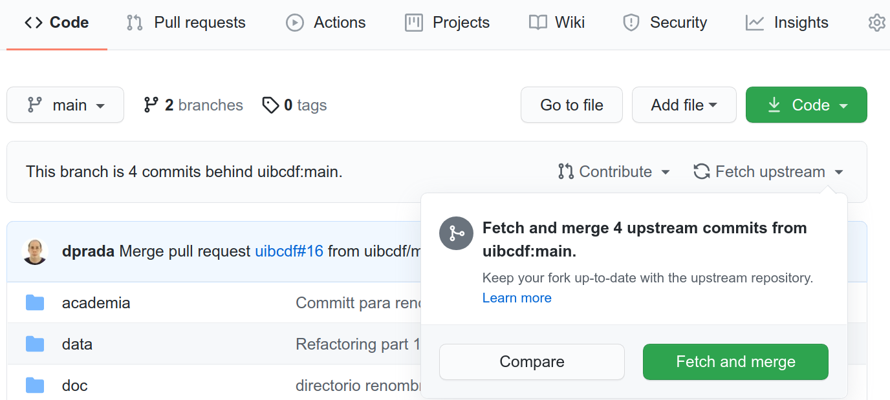
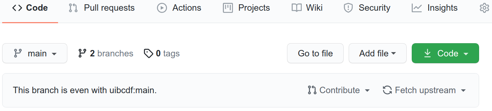
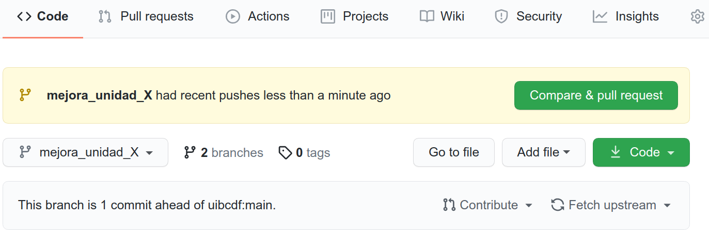
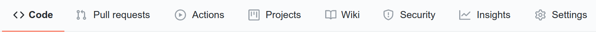
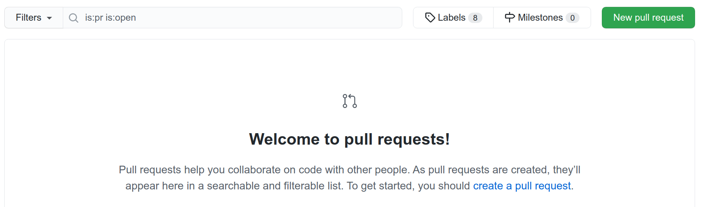
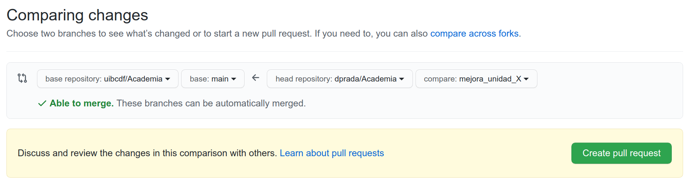
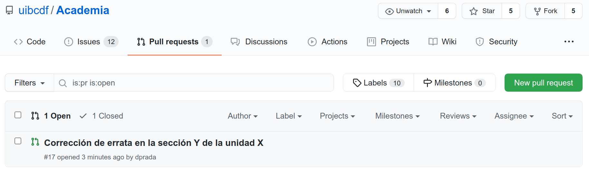

<p style="text-align:left;">
   <a href="../README.md">Ir al menú anterior</a>
   <span style="float:right;">
        <a href="../Que_es/Que_es.md">Ir a la unidad anterior</a>
   </span>
</p>

-----

<br>
<center>

</center>
<br>


# Cómo contribuir a desarrollar UIBCDF-Academia.

<div class="alert alert-info" role="alert">
<strong>Info:</strong> Si crees que este notebook necesita algún cambio no dudes en <a href="Como_contribuir.md" class="alert-link">contribuir a su desarrollo</a>.
</div>

<div class="alert alert-warning" role="alert">
<strong>Atención:</strong> Cualquier contribución que hagas al contenido UIBCDF-Academia queda
protegido bajo una licencia <a href="http://creativecommons.org/licenses/by-nc-sa/4.0/deed.es?ref=chooser-v1" target="_blank" rel="license noopener noreferrer" style="display:inline-block;">Creative Commons Attribution-NonCommercial-ShareAlike 4.0 International</a>.
</div>

<br>

Sería muy positivo para el repositorio que nos ayudaras a mejorarlo incluyendo aquellas cuestiones
que has echado de menos o consideras que necesitan ser corregidas. Si no tienes mucha experiencia
en el trabajo computacional en colaboración, puedes tomarte este repositorio como una primera
experiencia que te ayudará a entender algunas de las herramientas y dinámicas empleadas para el
desarrollo de un proyecto en colaboración. Para ello, en esta unidad encontrarás todo lo que debes conocer para comenzar a contribuir
en UIBCDF-Academia haciendo uso de
[Git](../../Laboratorio_computacional/Herramientas/Control_versiones_distribuida/Git/Git.md) y [GitHub](../../Laboratorio_computacional/Herramientas/Control_versiones_distribuida/GitHub/GitHub.md).

- [Cualquier contribución queda sometida a los términos de la licencia](#Cualquier-contribución-queda-sometida-a-los-términos-de-la-licencia)
- [Implementa los cambios sobre tu propio fork](#Implementa-los-cambios-sobre-tu-propio-fork)
- [Proceso de solicitud de cambios en el repositorio central](#Proceso-de-solicitud-de-cambios-en-el-repositorio-central)
   - [Creación de una rama en tu fork para realizar las modificaciones](#Creación-de-una-rama-en-tu-fork-para-realizar-las-modificaciones)
   - [Realiza las modificaciones en tu nueva rama](#Realiza-las-modificaciones-en-tu-nueva-rama)
   - [Creación de la solicitud de incorporación de cambios](#Creación-de-la-solicitud-de-incorporación-de-cambios)
   - [Ya eres colaborador o colaboradora de UIBCDF-Academia](#Ya-eres-colaborador-o-colaboradora-de-UIBCDF-Academia)

## Cualquier contribución queda sometida a los términos de la licencia

Antes de comenzar con la descripción de los pasos que debes dar para contribuir al desarrollo de
UIBCDF-Academia, debes saber que toda modificación o inclusión de nuevo contenido que hagas por tu
parte será, una vez incluido en el repositorio principal de UIBCDF-Academia, sometido y protegido
por las condiciones de la licencia Creative Commons Attribution-NonCommercial-ShareAlike 4.0
International misma que cubre todo el contenido de UIBCDF-Academia. Es tu responsibilidad como
colaborador haber revisado [las condiciones de la licencia](../La_licencia/La_licencia.md) antes de publicar tu contribución.

## Implementa los cambios sobre tu propio fork

Para poder hacer una solicitud de inclusión de tus cambios deberás implementar estos en tu propio *fork* (derivación del proyecto) en GitHub. ¿Qué es un *fork* de UIBCDF-Academia? ¿Cúal es la diferencia con un clon? Bueno, brevemente debes saber que clon y *fork* no son conceptos excluyentes para una dinámica de trabajo. De hecho, para incorporar los cambios trabajarás con un clon ubicado en tu computadora de tu fork de UIBCDF-Academia. Si no estás familiarizado con estos términos, como primera aproximación debes saber que:

- Llamaremos "clon" a la copia "cuyo desarrollo no será independiente" de un repositorio. El clon mantiene su vínculo
  con el original de tal manera que son imágenes del mismo proyecto y como tal pueden en cualquier
  momento compararse y sincronizarse mediante los comandos de Git `push` (si vas a traer los
  cambios sobre el clon) y `pull` (si vas a empujar los cambios desde el clon).
- Llamaremos "fork" a la copia "cuyo desarrollo será independiente" de un repositorio. El fork se ubicará en la cartera de
  proyectos de tu usuario en GitHub. Y como *fork*, los comandos `push` y `pull` no bastan para
  sincronizar el contenido del *fork* con el original, debe hacerse una petición de incorporación
  de cambios a los administradores del original -conocida en inglés como *Pull Request*-.

<div class="alert alert-success" role="alert">
<strong>Ayuda:</strong> Puedes encontrar más información sobre qué es un *fork* y cúal es la diferencia con un clon en los siguientes enlaces:
<a href='https://help.github.com/articles/fork-a-repo/'>aquí</a>, <a href='https://github.community/t5/Support-Protips/The-difference-between-forking-and-cloning-a-repository/ba-p/1372'>aquí</a>, <a href='https://stackoverflow.com/questions/6286571/are-git-forks-actually-git-clones'>aquí</a> o <a href='http://www.eqqon.com/index.php/Collaborative_Github_Workflow'>aquí</a>. Además puedes acudir a <a href='../../Laboratorio_computacional/Herramientas/Control_versiones_distribuida/README.md'>las unidades de UIBCDF-Academia dedicadas a las herramientas de control de versiones distribuida como Git y GitHub</a>.
</div>

Para hacer tu *fork*, habiendo iniciado sesión con tu usuario en GitHub, acude a [la web del repositorio principal de UIBCDF-Academia en GitHub](https://github.com/uibcdf/Academia) y haz click en "Fork".

<br>
<center>

</center>
<br>

Ya puedes acudir a tu página de GitHub y encontrar UIBCDF-Academia entre tus repositorios. Ahora, para hacer un clon local de tu *fork* de UIBCDF-Academia. Sustituye en el siguiente comando 'tu-nombre' por tu nombre de usuario en GitHub, y ejecútalo en una terminal de la computadora con la que vas a trabajar sobre el directorio en el que quieras ubicarlo, en mi caso mi carpeta '~/Projects':

```bash
cd ~/Projects
git clone git@github.com:tu-nombre/Academia.git
```

Tu *fork* de UIBCDF-Academia, y su clon local en tu computadora, te van a permitir jugar y cambiar cosas sin alterar el repositorio central de UIBCDF-Academia. Puedes hacer lo que quieras en ellos. Una buena manera de proceder sería, dejar la rama principal, llamada "main", de tu *fork* como espejo del repositorio central y crear ramas (*branches*) para jugar con el repositorio y hacer modificaciones. Puedes solicitar incluir tus modificaciones en el repositorio principal de UIBCDF-Academia desde cualquiera de las ramas de tu *fork* -como verás más adelante-.

Pero espera, vaya, que ahora hemos usado un término que probablemente no conocías. ¿Qué
es una rama (*branch*) de tu repositorio? En realidad un proyecto gestionado por Git se compone de
ramas, es posible que hasta ahora no supieras de su existencia porque tu proyecto tiene únicamente
una que por defecto suele llamarse "main" (o "master"). Para que comprendas el concepto de rama,
vamos a imaginar una situación hipotética descrita en la siguiente secuencia:

- Es martes y has trabajado en tu proyecto. Ya casi lo tienes. Debe estar listo para el viernes. Pero como siempre pasa,
  acabas de tener una idea que no sabes todavía si te convence del todo. Implementarla supone
  modificar muchas cosas... es arriesgado porque puede que tanta modificación arruine la versión
  del proyecto que ya tienes. Sin mucho pensar, decides ser valiente y comenzar a editar los
  archivos. Nooo! Espera! Déjalo como estaba y haz uso de un controlador de versiones como Git.
- Defines primero la carpeta principal donde tienes los archivos con los que estás trabajando como
  proyecto "seguido o administrado" por Git. Lo que ahora mismo tienes se registrará como rama
  principal llamada probablemente "main" o "master".
- Ahora crea una rama que llamaremos aquí "modificación A". Dile a Git que quieres saltar a la
  nueva rama, y comienza a implementar modificaciones.
- Ya es miércoles y no te gusta como está quedando. Se te ocurre que podías haber comenzado a
  modificar lo del martes de otra manera. No te preocupes. Dile a Git que quieres hacer una nueva
  rama que llamaremos "modificación B" a imagen y semejanza de la rama "main" -que no tiene
  cambios desde el martes-. Salta a la nueva rama "modificación B" y comienza de nuevo incluir
  modificaciones.
- Es jueves, ya no sabes qué opción quedó mejor, la versión de "main", "modificación A" o "modificación B". Con Git
  puedes saltar de una a otra, incluso seguir desarrollrándolas independientemente.
- Por fín es viernes. Claramente la versión de la rama "modificación B" quedó mejor que como estaba
  el proyecto el martes, y mejor también que la versión de la rama "modificación A".
- Pídele a Git que compare la rama "main" con "modificación B" y que sincronice la primera con la
  segunda, implementando los cambios (las diferencias). Ya tienes "main" tal y como dejaste "modificación B". Puedes borrar ahora si quieres las ramas
  "modificación B" y "modificación A".
- Por último, si es que tenías un clon remoto y principal de tu proyecto en GitHub, sincroniza tu
  rama "main" del clon en GitHub con tu "main" del clon local de tu computadora empujando los
  cambios con el comando de Git `pull` (desde tu clon local al clon remoto en GitHub).

<div class="alert alert-success" role="alert">
<strong>Ayuda:</strong> Puedes encontrar más información sobre cómo trabajar con las ramas de Git en <a href='../../Laboratorio_computacional/Herramientas/Control_versiones_distribuida/README.md'>la unidad dedicada en UIBCDF-Academia a esta herramienta</a>.
</div>

## Proceso de solicitud de cambios en el repositorio central

Supongamos que has detectado un error en una unidad y lo quieres corregir, o consideras que una explicación no es clara, o quieres añadir un párrafo, o conoces documentación o tutoriales que quieres compartir en la sección de la unidad dedicada a enlistar otras fuentes útiles de información. Edita lo que quieras localmente en el fichero de tu fork, o del clon de tu fork, y cuando consideres que está listo reinicialo y ejecútalo de principio a fin (sólo los Jupyter notebooks que contienen cambios). Compromete los cambios en tu rama. Súbe estos cambios al clon principal de tu *fork* en GitHub -si estabas trabajando con un clon local en tu computadora-, y haz una solicitud de incorporación de cambios, *Pull Request* (o PR en la jerga de Git), en el repositorio original de UIBCDF-Academia. Veamos este proceso paso a paso.

### Creación de una rama en tu fork para realizar las modificaciones

Como habíamos anticipado anteriormente, la forma más limpia de realizar una contribución sería
proponerla desde una rama diferente a la principal de tu *fork*. En primer lugar, dado que vamos a
crear la rama desde la principal de tu fork, llamada "main", vamos a asegurarnos de que ésta está
actualizada con respecto al repositorio principal de UIBCDF-Academia en GitHub. En la web principal
de tu *fork* encontrarás una indicación de si la rama principal está con el mismo contenido que la
principal del repositorio original o no. En caso de que tengas el mismo contenido el mensaje que
debes ver es el siguiente:

<br>
<center>

</center>
<br>

Por el contrario, si la rama "main" de tu *fork* está por detrás de la rama "main" del repositorio
original, verás el siguiente mensaje. El botón "Fetch upstream" despliega en esa situación un menú
para comparar las diferencias o traer los cambios a tu *fork* ("Fetch and merge").

<br>
<center>

</center>
<br>

Ya sabemos entonces que tu *fork* está actualizado. Si es necesario empareja ahora el clon local de
tu computadora con el de tu GitHub. Ejecuta en la terminal de tu computadora, dentro del directorio
de tu clon:

```bash
git pull
```

Ahora vamos a crear una rama que por ejemplo llamaremos "mejora\_unidad\_X":

```bash
git checkout -b mejora_unidad_X
```

Ahora empuja tu nueva rama a tu clon origen del *fork* en GitHub:

```bash
git push origin mejora_unidad_X
```

Puedes ver ahora que tu repositorio *fork* remoto tiene ahora dos ramas:

<br>
<center>

</center>
<br>

Haz click sobre el indicador del número de ramas "2 branches" para visualizar más
información de las ramas del repositorio. O puedes, en tu clon local, ejecutar el comando siguiente
para enlistar las ramas que tienes localmente (añade "-r" para ver las remotas o "-a" para verlas
todas):

```
git branch 
```

### Realiza las modificaciones en tu nueva rama

Ahora ya podemos en nuestra nueva rama local hacer los cambios que queramos. Despues de eso,
añadimos los ficheros nuevos que hayamos podido crear nosotros -si es el caso-:

```bash
git add --all
```

Y comprometemos los cambios (o "hacemos un *commit*" en jerga de Git) en nuestra rama local para despues empujarlos al clon remoto del *fork* ubicado en
GitHub:

```bash
git commit -a -m 'descripción breve de los cambios'
git push origin mejora_unidad_X
```

### Creación de la solicitud de incorporación de cambios

Ya tenemos los cambios donde queríamos. Si con el botón superior izquierdo de la web de tu fork en
GitHub que ahora mismo dice "main", seleccionamos la rama "mejora\_unidad\_X", veremos que encontramos un mensaje que nos
advierte de que esta rama está avanzada 1 *commit* con respecto de la rama "main" del repositorio
principal de UIBCDF-Academia.

<br>
<center>

</center>
<br>

Allí mismo encontramos un atajo, mostrado de manera temporal en una caja amarilla, para hacer nuestro *pull request*. Pero nosotros ahora no lo vamos a emplear. Vamos a acudir a la opción del menú superior, "Pull requests", siempre presente:

<br>
<center>

</center>
<br>

Aparace una nueva vista del historial de los *pull requests* realizados junto con la opción de realizar uno nuevo: 

<br>
<center>

</center>
<br>

Selecciona el botón verde de la derecha que dice "New pull request", y ajusta las opciones que
aparecerán para que el flujo de incorporación de cambios sea desde tu rama "mejora\_unidad\_X" a la
rama "main" del repositorio UIBCDF-Academia. Si los dos repositorios son compatibles y no es
necesario nada más para incorporar tus cambios verás un mensaje que anuncia que las ramas pueden
ser emparejadas de manera automática. Ya puedes crear la solicitud de incorporación de cambios
haciendo click en el botón verde que dice "Create pull request":

<br>
<center>

</center>
<br>

Ahora es cuando "estas haciendo un PR". Titula y describe el motivo y los efectos del cambio.
Documéntalo para que los administradores de UIBCDF-Academia puedan comprender rapidamente el
propósito de tu PR.

<br>
<center>

</center>
<br>

Nota que debajo de esas cajas de texto todavía hay más página web. Aparece la descripción detallada
de todos los cambios que estás proponiendo, fichero a fichero.

Por último, ¡ya puedes hacer click en el botón verde que dice "Create pull request"!

¿Ya lo hiciste? Ahora tu PR aparece como solicitud pendiente de revisión en [la web del repositorio
principal de UIBCDF-Academia dedicada a los pull requests](https://github.com/uibcdf/Academia/pulls):

<br>
<center>

</center>
<br>

Puedes hacer click en tu PR, verás que éste está pendiente de revisión. Los administradores de
UIBCDF-Academia lo revisarán y se comunicarán contigo mediante mensajes en esa
misma página hasta concluir que tus cambios pueden ser aceptados e incorporados.


<div class="alert alert-success" role="alert">
<strong>Ayuda:</strong> Puedes encontrar más información sobre cómo trabajar con Git y GitHub, así como más detalles sobre cómo realizar un PR o gestionar las ramas, en <a href='../../Laboratorio_computacional/Herramientas/Control_versiones_distribuida/README.md'>las unidades de UIBCDF-Academia dedicadas a las herramientas de control de versiones distribuida</a>.
</div>


### Ya eres colaborador o colaboradora de UIBCDF-Academia

Si has llegado hasta aquí y verdaderamente has hecho un PR a UIBCDF-Academia: ¡enhorabuena!
Te damos la enhorabuena por dos motivos. El primero, porque si no tenías conocimientos previos sobre el uso de
Git y GitHub tiene mérito haber seguido la guía hasta aquí. Y el segundo, enhorabuena por
comprender como funciona el universo de "lo *open source*" y en particular de "la *open science*". A lo
largo del tiempo que vayas a trabajar como investigador estamos seguros de que emplearás
muchas herramientas de código abierto, libres y gratuitas. Por ejemplo, si estás usando una
distribución de Linux gratuita, ya lo estás haciendo. Es importante que entres en el
juego desde el principio y comprendas que si otros y otras dedicaron tiempo y esfuerzo a desarrollar
contenido y herramientas que puedes usar gratuitamente, es porque entendían que en comunidad,
colaborando, podemos avanzar mejor y más rápido. Así que si tu también comprendes esto y participas de esta manera de enfrentar el
desarrollo científico y técnico... siéntete parte de la comunidad no sólo recibiendo, sino
también aportando. Ah! y aprende también que en esta comunidad se respeta la autoría. Agradece y menciona
siempre las herramientas de código abierto que usaste, igual que los demás siempre van a reconocer
tu autoría. Si tu PR fue aceptado, ya puedes buscarte en [la sección de colaboradores de
UIBCDF-Academia](https://github.com/uibcdf/Academia/graphs/contributors).

Deja que te digamos que este proceso, si lo desconocías, ha sido un buen simulacro de
cómo contribuir a desarrollar o mejorar una librería científica. ¡Esperamos que en el futuro te
atrevas a interaccionar con los desarrolladores de las librerías que vas a usar! ¡Estamos seguros de
que tu contribución les será de gran ayuda!

<br />

<div style='text-align: right;'> <a href="../La_licencia/La_licencia.md">Ir a la siguiente unidad</a> </div>

-------
<p xmlns:cc="http://creativecommons.org/ns#" xmlns:dct="http://purl.org/dc/terms/"><a property="dct:title" rel="cc:attributionURL" href="https://github.com/uibcdf/Academia">UIBCDF-Academia</a> por <a rel="cc:attributionURL dct:creator" property="cc:attributionName" href="https://github.com/uibcdf/Academia/graphs/contributors">UIBCDF Lab, autores y colaboradores</a> es material protegido bajo una licencia <a href="http://creativecommons.org/licenses/by-nc-sa/4.0/deed.es?ref=chooser-v1" target="_blank" rel="license noopener noreferrer" style="display:inline-block;">Attribution-NonCommercial-ShareAlike 4.0 International</a></p>

