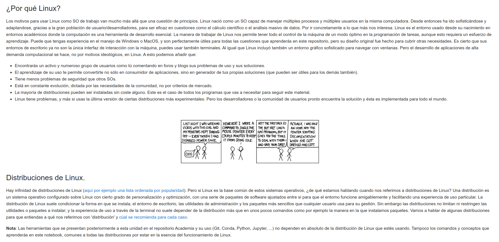
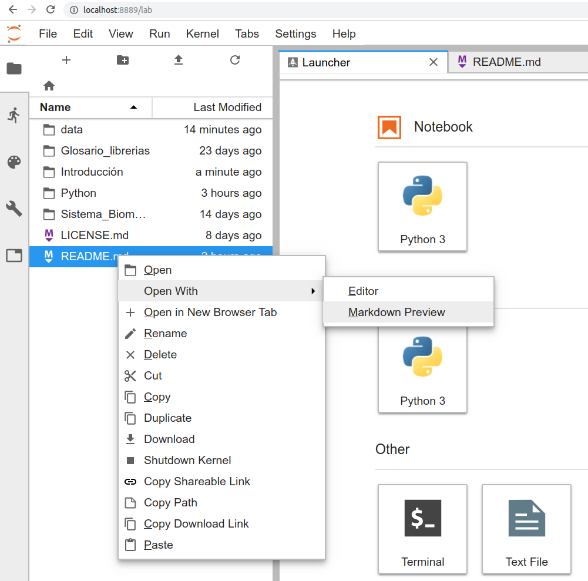
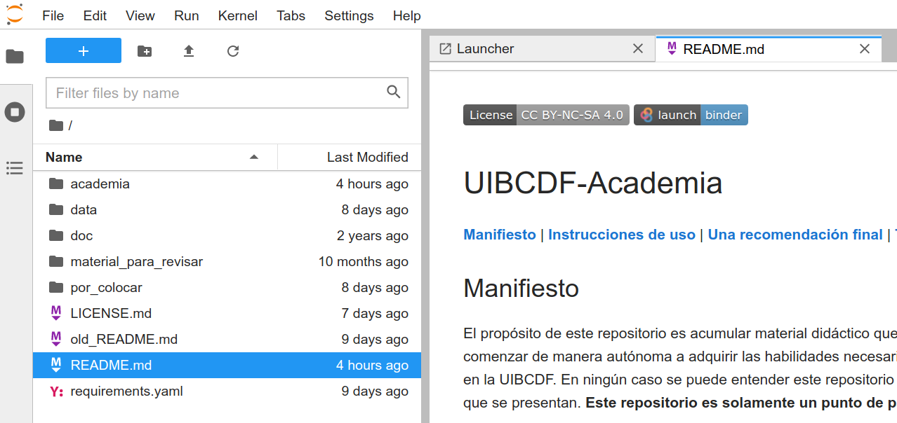

<p style="text-align:left;">
   <a href="../README.md">Ir al menú anterior</a>
   <span style="float:right;">
        <a href="../Que_es/Que_es.md">Ir a la unidad anterior</a>
   </span>
</p>

-----
<br>

<center></center>

<br>

# Cómo se usa UIBCDF-Academia

<div class="alert alert-info" role="alert">
<strong>Info:</strong> Si crees que este notebook necesita algún cambio no dudes en <a href="../Como_contribuir/Como_contribuir.md" class="alert-link">contribuir a su desarrollo</a>.
</div>

<div class="alert alert-danger" role="alert">
<strong>En desarrollo:</strong> 90%.
</div>

<br>

Antes de encontrar una respuesta a cómo se usa UIBCDF-Academia, te recordamos, como se explica en la sección [¿Qué es UIBCDF-Academia?](../Que_es/Que_es.md), que este repositorio **no pretende ser una guía completa sino un punto de partida para cada uno de los temas y conceptos que recoge**. Si eres un estudiante, o un colaborador de la UIBCDF, encontrarás aquí muchas pautas para comenzar a trabajar con nosotros; así como un repositorio que centraliza dudas y respuestas sobre los conceptos y herramientas del día a día del desarrollo de nuestros proyectos. Si por el contrario eres una persona ajena a la UIBCDF pero vas a comenzar a trabajar con alguno de los conceptos introducidos en este repositorio, eres más que bienvenido a hacer uso de UIBCDF-Academia como uno más del equipo. En ambos casos te exhortamos, de nuevo, a que te tomes UIBCDF-Academia como una introducción, en un formato accesible, a conceptos casi siempre complejos. Sin pretender abrumar, ni con la descripción exhaustiva del panorama completo, ni con excesivos detalles. Eso sí, debes ser consciente, y es tu responsabilidad como investigador, de que tras tener una idea preliminar y general del concepto en cuestión debes profundizar. Pero ese es tu trabajo...

<br>
<center>

</center>
<br>

A continuación encontrarás una guía sobre cómo comenzar a trabajar con UIBCDF-Academia. Es posible que no tengas muchos conocimientos previos sobre qué es un repositorio en GitHub o qué es Jupyter lab. No te preocupes. Si te animas, esta unidad puede servirte también como primera introducción al uso de ciertas herramientas propias de un laboratorio computacional que te servirán para el trabajo científico en colaboración. 

Estos son los contenidos que encontrarás en adelante.

- [Los elementos de UIBCDF-Academia](#Los-elementos-de-UIBCDF-Academia)    
   - [Las unidades de UIBCDF-Academia y su navegación](#Las-unidades-de-UIBCDF-Academia-y-su-navegación)     
      - [Unidades de menú](#Unidades-de-menú)
      - [Unidades de contenido](#Unidades-de-contenido)
      - [Unidades Markdown](#Unidades-Markdown)
      - [Unidades Jupyter notebook](#Unidades-Jupyter-notebook)
      - [Elementos comunes encontrados en todas las unidades](#Elementos-comunes-encontrados-en-todas-las-unidades)
         - [Hiperenlaces de navegación](#Hiperenlaces-de-navegación)
         - [Las cajas de alerta](#Las-cajas-de-alerta)
         - [La licencia Creative Commons](#La-licencia-Creative-Commons)
   - [El tablón de cuestiones y las discusiones](#El-tablón-de-cuestiones-y-las-discusiones)
      - [El tablón de cuestiones en la web de GitHub](#El-tablón-de-cuestiones-en-la-web-de-GitHub)
      - [Las discusiones en la web de GitHub](#Las-discusiones-en-la-web-de-GitHub)
- [Únicamente quiero leer el contenido de UIBCDF-Academia](#Únicamente-quiero-leer-el-contenido-de-UIBCDF-Academia)
- [Quiero interactuar con las unidades de UIBCDF-Academia con la ayuda de Binder](#Quiero-interactura-con-las-unidades-de-UIBCDF-Academia-con-la-ayuda-de-Binder)
- [Quiero trabajar con mi propia copia local de UIBCDF-Academia](#Quiero-trabajar-con-mi-propia-copia-local-de-UIBCDF-Academia)
   - [Configurando Git](#Configurando-Git)
   - [Configurando GitHub](#Configurando-GitHub)
   - [Creando el entorno de trabajo con Conda](#Creando-el-entorno-de-trabajo-con-Conda)
   - [Clonando el repositorio UIBCDF-Academia](#Clonando-el-repositorio-UIBCDF-Academia)
   - [Abriendo tu copia local con JupyterLab](#Abriendo-tu-copia-local-con-JupyterLab)
   - [Leyendo y ejecutando los contenidos](#Leyendo-y-ejecutando-los-contenidos)
   - [Guardando cambios en tus notebooks](#Guardando-cambios-en-tus-notebooks)
   - [Cerrando JupyterLab](#Cerrando-JupyterLab)
- [Quiero contribuir a desarrollar UIBCDF-Academia](#Quiero-contribuir-a-desarrollar-UIBCDF-Academia)

Comencemos por describir los distintos elementos de UIBCDF-Academia atendiendo a sus funciones.

## Los elementos de UIBCDF-Academia

### Las unidades de UIBCDF-Academia y su navegación

Según su función podemos encontrar dos tipos de unidades: de menú o de contenido. Según el formato
podemos encontrar unidades de tipo [Markdown]() o [Jupyter notebook]().

#### Unidades de menú

La estructura de unidades de menú componen el esqueleto de UIBCDF-Academia.
Estas unidades contienen siempre una tabla de contenidos para describir y dar acceso a un bloque de otras unidades. 
Verás que estas unidades contienen además otros elementos:
- Una cabecera con un enlace para navegar a la unidad de menú de contenidos anterior.
- Porcentajes de desarrollo junto a cada item del menú de contenidos: en <span style="color:#185927">verde</span> para indicar que la
  unidad está completa (100%), en <span style="color:#aa7d00">ambar</span> si la unidad está parcialmente implementada, y en <span style="color:#823138">rojo</span> si
  la unidad no contiene contenido todavía (0%).
- Texto con una breve explicación del contenido del bloque o sus unidades -*Opcional*-.
- La referencia a la licencia Creative Commons.

<center></center>

#### Unidades de contenido

Las unidades de contenido son el músculo de UIBCDF-Academia. Como su nombre indica, son las
depositarias del contenido en sí. Y deben tener, en la medida de lo posible, una estructura
narrativa conclusa y autocontenida. Obviamente requieren de otras unidades o referencias para poder
ser comprendidas, pero todas estas conexiones necesarias serán encontradas siempre a lo largo del
discurso de la unidad.

La estructura de una unidad de contenida será siempre similar. Descrita de arriba abajo:
- Una barra de navegación superior para ir al menú o la unidad anterior.
- Un título posiblemente acompañado de una figura junto con un párrafo introductorio a la unidad.
- Una tabla de contenidos con la que poder navegar en la unidad.
- Una secuencia de secciones y subsecciones con el desarrollo del contenido de la unidad.
- Una bloque con dos secciones auxiliares:
   - "Dudas, problemas técnicos y soluciones" donde encontrarás el vinculo entre la unidad de
     contenido y el [Tablón de Cuestiones (*Issues Board*)]() del repositorio UIBCDF-Academia en
     GitHub.
   - "Más recursos útiles" donde encontrarás enlaces a documentacion, tutoriales, webinars y cursos
     online gratuitos con los que ampliar tu conocimiento sobre el concepto o conceptos expuestos
     en la unidad.
- Una barra de navegación inferior para ir a la siguiente unidad.
- La referencia a la licencia Creative Commons.

<center></center>

<center></center>

<center></center>

#### Unidades Markdown

Aquellas unidades que no contienen código en Python y que por lo tanto no requieren la
participación activa del usuario están escritas en el lenguaje de marcado Markdown. Estás unidades
son visualizadas adecuadamente para el usuario en la web del repositorio de UIBCDF-Academia en GitHub. Sin
embargo JupyterLab muestra por defecto su código fuente al abrirlas desde su menú de ficheros. Para
poder previsualizarlas adecuadamente en Jupyter debes hacer click con el botón derecho del ratón
sobre el nombre del fichero \*.md (markdown) en la barra izquierda de navegación de ficheros, y seleccionar la opción del menú recien desplegado 'Open With > Markdown Preview'.

<center></center>

Esto último no es necesario cuando se navega entre unidades haciendo uso de los hiper-enlaces que
encontrarás en ellas.

No te preocupes si todavía no conoces el lenguaje de programación Python, el lenguaje de marcado Markdown, o no sabes qué es el formato
Jupyter notebook y su plataforma JupyterLab. Encontrarás a lo largo de esta unidad todas las indicaciones
necesarias en este momento para hacer uso de UIBCDF-Academia sin problema. Eso te permitirá acceder a las unidades que te
introduzcan estas herramientas.

<div class="alert alert-success" role="alert">
<strong>Ayuda:</strong> Si todavía no sabes lo que es el lenguaje de marcado Markdown, te invitamos a visitar <a href='../../Laboratorio_computacional/Herramientas/Lenguajes_marcado/Markdown/Markdown.md' class="alert-link">la unidad dedicada a este lenguaje</a>.
</div>


#### Unidades Jupyter notebook

Aquellas unidades que contienen código en Python y que por lo tanto están pensadas para que el
usuario pueda tener una participación activa interactuando con su contenido, tienen el formato de
libreta Jupyter (*Jupyter notebook*). Este formato permite alternar lenguaje de marcado Markdown
con código de programación y el resultado de su ejecución. Es el formato ideal para registrar la
narrativa de un flujo de trabajo científico computacional.

De nuevo, como se dijo en la sección anterior, no te preocupes si todavía no conoces el lenguaje de programación Python, el lenguaje de marcado Markdown, o no sabes qué es el formato
Jupyter notebook y su plataforma JupyterLab. A lo largo de esta unidad encontrarás todas las indicaciones
necesarias en este momento para hacer uso de UIBCDF-Academia. No hace falta que tengas un conocimiento previo de estos formatos para acceder a las unidades que te
introduzcan estas herramientas.

<div class="alert alert-success" role="alert">
<strong>Ayuda:</strong> UIBCDF-Academia cuenta con <a href='../../Laboratorio_computacional/Herramientas/Jupyter/README.md' class="alert-link">un bloque de unidades sobre qué es y cómo usar Jupyter</a>.
</div>


#### Elementos comunes encontrados en todas las unidades

Independientemente del tipo de unidad y su formato, hay elementos comunes que puedes encontrar en
cualquier unidad de UIBCDF-Academia: son las barras de navegación, las cajas de alerta y la
referencia a [la licencia Creative Commons](../La_licencia/La_licencia.md).

##### Hiperenlaces de navegación

Todas las unidades contienen en su cabecera, o en su pie, hiperenlaces para la navegación en
UIBCDF-Academia:

- "Ir al menú anterior" en la parte superior izquierda para ir a la unidad de tipo menú
  inmediatamente anterior.
- "Ir a la unidad anterior" en la parte superior derecha para ir a la unidad de contenido anterior en la secuencia
  de unidades de un bloque.
- "Ir a la siguiente unidad" en la parte inferior derecha para ir a la unidad de contenido siguiente en la
  secuencia de unidades de un bloque.

##### Las cajas de alerta

A lo largo de las unidades verás cajas de texto con mensajes con un código de color según su
propósito: azul para las cajas de información o sugerencias, rojo para las cajas de porcentaje de progreso,
amarillo para las cajas de atención, y verde para las cajas de ayuda.

<br>

<div class="alert alert-info" role="alert">
<strong>Información o Sugerencia:</strong> En esta caja encontrarás información adicional o sugerencias sobre la unidad o el contenido de la sección en la que se encuentra.
</div>

<div class="alert alert-danger" role="alert">
<strong>En desarrollo:</strong> En esta caja encontrarás el porcentaje de progreso de la unidad si
es que se encuentra en desarrollo.
</div>

<div class="alert alert-warning" role="alert">
<strong>Atención:</strong> En esta caja encontrarás mensajes de advertencia sobre algo que requiere
tu atención.
</div>

<div class="alert alert-success" role="alert">
<strong>Ayuda:</strong> En esta caja encontrarás mensajes cuyo contenido estará dirigido a ayudarte a ejecutar o interpretar correctamente los contenidos del notebook, o a darte más recursos puntuales con los que ampliar la información de la unidad o la sección en la que se encuentra.
</div>

<br>

##### La licencia Creative Commons

Todas las unidades cuentan con una referencia a la licencia Creative Commons como último elemento.
Encontrarás más información sobre esta licencia en la sección de este bloque llamada ["La licencia
Creative Commons BY-NC-SA 4.0"](../La_licencia/La_licencia.md).

<br>

### El tablón de cuestiones y las discusiones

Además de las unidades, UIBCDF-Academia es también una plataforma de interacción entre sus usuarios
y desarrolladores. Esta interacción se lleva a cabo en [la web del repositorio de UIBCDF-Academia en GitHub](https://github.com/uibcdf/Academia) mediante [su tablón de cuestiones (*Issues Board*)](https://github.com/uibcdf/Academia/issues) y [su área de discusiones](https://github.com/uibcdf/Academia/discussions).

Es muy, muy, muy importante que te animes a interaccionar o colaborar con cualquiera de estas dos
opciones. Esto va a permitir que quede un registro escrito de sugerencias, propuestas, dudas, soluciones, etc.,
para la futura consulta de cualquier usuario.

#### El tablón de cuestiones en la web de GitHub

[El tablón de cuestiones en la web del repositorio de UIBCDF-Academia](https://github.com/uibcdf/Academia/issues) es un elemento común a
cualquier proyecto o repositorio en GitHub. Se trata de una herramienta diseñada para, a
la vista de todos los colaboradores y posibles usuarios, reportar sugerencias, preguntas, errores,
puntos de mejora, etc. de un proyecto en colaboración -originalmente de desarrollo de software-. El
formato es adecuado para que hagamos de esta herramienta un foro público de interacción. Aquí
podrás publicar "temas" o "cuestiones" relativas a UIBCDF-Academia: sugerencias, propuestas, errores encontrados, preguntas, etc.

Cada "tema" o "cuestión" es un hilo de conversación abierto a la posibilidad de que cualquiera
responda o contribuya. Estos hilos, si se considera pertinente, se pueden cerrar y archivar para su
futura lectura o reapertura.

Si vas a abrir un tema en [el tablón de cuestiones](https://github.com/uibcdf/Academia/issues) procura seguir estas indicaciones:
- Dale un título suficientemente explícito para que pueda comprenderse facilmente la naturaleza
  del tema en un primer vistazo.
- Sé suficientemente descriptivo en el texto de tu mensaje. Debe ser comprendido por cualquiera.
- **Sé respetuoso con todos en tu interacción**. Cualquier falta de respeto no será tolerada por los
  administradores del repositorio. Éstos no dudarán en tomar las acciones necesarias para asegurar
  la correcta convivencia entre los usuarios del tablón de cuestiones.

Por último, existen una serie de "temas" o "cuestiones" abiertas por los desarrolladores de
UIBCDF-Academia que serán usadas como foros técnicos de herramientas o conceptos expuestos. Estos
temas estarán señalados con la etiqueta "Foro", su título suele comenzar con las palabras "Foro Técnico:", y no se cerrarán bajo ningún concepto.

<div class="alert alert-success" role="alert">
<strong>Ayuda:</strong> Puedes conocer más sobre esta herramienta en <a href='../../Laboratorio_computacional/Herramientas/Control_versiones_distribuida/GitHub/GitHub.md' class="alert-link">la unidad dedicada a GitHub</a>.
</div>

#### Las discusiones en la web de GitHub

GitHub incluye [un área de discusiones](https://github.com/uibcdf/Academia/discussions) como herramienta de cualquier repositorio allí almacenado.
Abriremos o participaremos en una discusión cuando consideremos que el propósito lo amerita. Es
decir, o cuando el asunto a abordar sea lo sufientemente general o vago, o cuando estimemos que las
propias caracteristicas de una discusión de GitHub van a facilitar la interacción entre usuarios o
la exposición de las ideas.

Como consejo, y ante la duda, comienza mejor abriendo un tema en [el tablón de cuestiones](https://github.com/uibcdf/Academia/issues). Siempre
hay tiempo de migrar dicho asunto al [área de discusiones](https://github.com/uibcdf/Academia/discussions).

<div class="alert alert-success" role="alert">
<strong>Ayuda:</strong> Puedes conocer más sobre esta herramienta en <a href='../../Laboratorio_computacional/Herramientas/Control_versiones_distribuida/GitHub/GitHub.md' class="alert-link">la unidad dedicada a GitHub</a>.
</div>

<br>

## Únicamente quiero leer el contenido de las unidades de UIBCDF-Academia

Si tu propósito es leer el contenido de las unidades sin interaccionar con aquellas de [tipo Jupyter
notebook](#Unidades-Jupyter-notebook), la misma [web del repositorio de UIBCDF-Academia](https://github.com/uibcdf/Academia) te sirve para ello. GitHub muestra una
versión 'estática' tanto de ficheros Markdown como de Jupyter Notebooks. Y cuando decimos estática
nos referimos a que no puede insteraccionar modificando su contenido. Lo que vas a ver es una
página web "renderizada" para cada una de las unidades. En dicha visualización de las unidades, con lo único con lo que vas a poder
iteractuar es con los hiperenlaces. Úsalos para navegar en la estructura de unidades de
UIBCDF-Academia.

Puedes empezar por seguir lo indicado en [la sección "Tabla de contenidos" del README.md principal de la web del repositorio en GitHub](https://github.com/uibcdf/Academia/#Tabla-de-contenidos) o ir directamente al [primer menú de unidades de UIBCDF-Academia](https://github.com/uibcdf/Academia/tree/main/academia/UIBCDF-Academia#readme).

<div class="alert alert-warning" role="alert">
<strong>Atención:</strong> Las unidades de tipo Markdown se visualizan en GitHub en "blanco y negro". Así que, accediendo a las unidades de esta manera, las cajas de alerta y el texto de color no se distinguirán en algunas de ellas. Por lo demás, los contenidos son perfectamente legibles.
</div>

<br>

## Quiero interactuar con las unidades de UIBCDF-Academia con la ayuda de Binder

Existen [unidades en UIBCDF-Academia en formato Jupyter notebook](#Unidades-Markdown). Este formato nos permite construir un relato en una
misma unidad entretejiendo texto, figuras, tablas, videos, hiperenlaces... y código ejecutable. Y
el resultado del código se muestra insertado inmediatamente a continuación de éste. Sin alterar el
orden cronológico del relato.

Estas unidades no debes interpretarlas como narrativas pre-escritas, rígidas. No, tú puedes modificar sus celdas,
o insertar nuevas celdas, para por ejemplo probar a modificar el código o el experimento
computacional propuesto en la versión original de la unidad. Puedes, y debes, interactuar con estas
unidades. Pero, ¿Qué necesitas para interactuar? Fundamentalmente necesitas hacer uso del navegador-interpretador de
ficheros Jupyter notebook, que no es otro que lo que conocemos como [Jupyter o JupyterLab](../../Laboratorio_computacional/Herramientas/Jupyter/Jupyter/Jupyter.md). Si no
lo conocías previamente, y no lo tienes instalado en tu computadora, no te preocupes. Existen
diversas herramientas en la red que te permiten usar Jupyter de manera remota. [Binder](https://mybinder.org) es una de
las más populares y sencillas. Quizá por eso, y mientras siga siendo un servicio gratuitp y funcional para
el propósito de este proyecto, la usaremos para ofrecerte acceso a tu propia versión de UIBCDF-Academia interactiva (tu propia sesión de Jupyter).

Para abrir UIBCDF-Academia en Binder únicamente necesitas tu navegador. Haz click en la siguiente
insigna:

<br>
<center><a href="https://mybinder.org/v2/gh/uibcdf/Academia/main?urlpath=lab"></a></center>
<br>

Ya estás lanzando tu propio JupyterLab, en remoto gracias a Binder. Espera a que termine de
cargarse. Ya puedes navegar por tu cuenta por los ficheros de este repositorio, para ello puedes hacer uso de la
barra de ficheros a la izquierda de la pantalla. Los ficheros de tipo Markdown se abrirán por
defecto en su versión mas cruda, como fichero de texto para ser editado. Cómo se explicó
anteriormente, debes seleccionar la opción que da Jupyter de previsualizarlos. Sin embargo, para
interactuar correctamente con los ficheros de tipo Jupyter notebook (\*.ipynb) no debes hacer nada
más que abrirlos.

Si quieres dejarte guiar por la estructura de hiperenlaces de UIBCDF-Academia, puedes comenzar por
previsualizar el fichero principal "README.md" y acudir al enlace que se encuentra en la sección
"Tabla de contenidos", o abrir la carpeta "academia" y previsualizar el fichero "README.md" que
encontrarás en su interior. Recuerda, [como se explicó más arriba], para previsualizar un fichero Markdown (\*.md) haz click con el botón derecho sobre su nombre en el navegador de archivos y
selecciona la opción 'Open With > Markdown Preview' del menú desplegado.

<br>
<center></center>
<br>

Ya con tu JupyterLab remoto abierto en Binder, los ficheros Markdown no tienen más secreto. Y las
unidades de tipo Jupyter notebook tampoco mucho más. Una libreta de Jupyter es una secuencia de
celdas que puedes ejecutar en el orden que quieras, pero con un contenido implementado por [los autores y colaboradores de UIBCDF-Academia](https://github.com/uibcdf/Academia/graphs/contributors) para ser
interpretado en orden de arriba a bajo. Cada celda puede contener texto marcado en lenguaje
Markdown o código (en este caso en Python), y se ejecuta con la tecla 'entrar' de tu teclado -y con
la celda previamente seleccionada-. ¿Necesitas saber mucho más para comenzar? No mucho más, quizá
que puedes reiniciar la libreta de Jupyter con la opción "Restart Kernel and Clear..." que encuentras en el
menú "Kernel" de la barra superior de tu JupyterLab remoto. Pero ya lo tienes todo para poder
comenzar a acceder a las unidades de UIBCDF-Academia de una manera interactiva.

<div class="alert alert-success" role="alert">
<strong>Ayuda:</strong> UIBCDF-Academia cuenta con <a href='../../Laboratorio_computacional/Herramientas/Jupyter/README.md' class="alert-link">un bloque de unidades sobre qué es y cómo usar Jupyter</a>. Si todavía no sabes lo que es el lenguaje de marcado Markdown, te invitamos a visitar <a href='../../Laboratorio_computacional/Herramientas/Lenguajes_marcado/Markdown/Markdown.md' class="alert-link">la unidad dedicada a este lenguaje</a>
</div>

<br>

## Quiero trabajar con mi propia copia local de las unidades de UIBCDF-Academia
 
<div class="alert alert-warning" role="alert">
<strong>Atención:</strong> Supondremos que estás usando como sistema operativo una distribución de Linux. Si no es tu caso, las unidades referenciadas en los mensajes que encontrarás aquí pueden ayudarte a adaptar el proceso.
</div>

Si quieres interactuar con tu propia copia local de las unidades de UIBCDF-Academia te felicitamos
por la iniciativa. Es lo que recomendamos a estudiantes y colaboradores. Esta sección describirá
paso a paso todo lo que tienes que hacer para preparar tu computadora para ello. Supondremos que no
tienes ningún conocimiento previo sobre todo lo que a partir de ahora te vamos a pedir. Si este es
tu caso, ¡Ánimo! Resolver esta situación te va a servir para comenzar en tu proceso de formación
en algunas de [las herramientas propias del trabajo de investigación computacional]('../../Laboratorio_computacional/Herramientas/README.md').

<br>
<center></center>
<br>

### Configurando Git

Comencemos configurando el controlador de versiones [Git](https://git-scm.com/). Es muy posible ya esté instalado en tu sistema operativo. Prueba a ejecutar en tu terminal:

```bash
git --version
```

Si el comando anterior no ofrece una salida de tipo

```
git version 2.25.1
```

puedes instalarlo de los repositorios centrales de tu distribución de Linux. En el caso de trabajar
con Ubuntu, basta el comando:

```bash
sudo apt-get install git
```

Es muy importante, de cara a tus posibles contribuciones en UIBCDF-Academia o cualquier otro
proyecto administrado por Git o ubicado GitHub, que configures ahora las credenciales de tu usuario para Git. De esta manera tus 'commits' y 'pull requests' estarán bien identificados. Ejecuta en la terminal los siguientes comandos tecleando tu nombre y tu dirección de correo electrónico entre comillas:

```bash
git config user.name "Tu Nombre y Apellidos"
git config user.email "Tu dirección de email" # Debe ser la misma que usarás para registrar tu usuario en GitHub
```

Si quieres puedes modificar el editor de textos (emacs, vim, nano, etc.) que Git disparará por defecto:

```bash
git config --global core.editor "vim"
```

Puedes ahora comprobar que el archivo de configuración de git de tu usuario tiene tus datos:

```bash
more ~/.gitconfig
```

<div class="alert alert-success" role="alert">
<strong>Ayuda:</strong> En caso de que necesites más información para adaptar el proceso a tus necesidades, puedes visitar <a href='../../Herramientas/Control_versiones_distribuida/Git/Git.md'>la unidad de introducción a Git</a>. Si has tenido algún problema técnico puedes compartirlo con nosotros en <a href='https://github.com/uibcdf/Academia/issues/1'>el foro de Git del tablón de cuestiones de este repositorio</a>, allí centralizamos los problemas y soluciones para que la experiencia se acumule de manera visible para todos.
</div>

<br>

### Configurando GitHub

Este paso no es estrictamente necesario para trabajar con tu propia copia local de las unidades de UIBCDF-Academia. Pero si quieres participar de manera activa en [el tablón de cuestiones]() o [el área de discusiones](), o si quieres contribuir al desarrollo de UIBCDF-Academia implementando cambios, correcciones o material nuevo, tienes que disponer de una cuenta de usuario en GitHub (la cuenta básica es gratuita). Para ello, te invitamos a abrir la web [github.com](https://github.com/) y crea tu propio usuario

<div class="alert alert-warning" role="alert">
<strong>Atención:</strong> La cuenta de correo que incluíste en <a href='#Configurando-Git'>tu configuración local de Git</a> debe estar asociada a tu cuenta de usuario de GitHub para que este servicio pueda reconocer las modificaciones que localmente en tu computadora.
</div>

Ahora vamos a comunicarle a tu usuario de GitHub cuál es la o las máquinas desde las que vas a trabajar de manera remota. De esta manera podrás tirar y empujar cambios a tu computadora local de manera segura (mediante SSH). Para ello debes de seguir el guión descrito en [la página de soporte de GitHub correspondiente](https://help.github.com/articles/connecting-to-github-with-ssh/). Aquí vamos resumimos a continuación el proceso en el caso de que uses Linux (para Mac o Windows encuentra [aquí](https://help.github.com/articles/connecting-to-github-with-ssh/) las indicaciones).

Antes de comenzar, debes saber que SSH es un protocolo de comunicación encriptada entre computadoras. Seguramente conocerás el comando `ssh` si has tenido que acceder a otra máquina. En este caso nos vamos a valer del mecanismo que ssh tiene para, antes de pedir las credenciales de usuario (usuario y contraseña), reconocer que dos máquinas tienen su comunicación validada o si se desconocen: la clave de ssh. Un usuario de Linux puede generar su propia clave de ssh al margen de su password (repetimos que ésta funciona como mecanismo previo de autentificación). Vamos a ver si tienes dicha clave, o la tienes que generar:

```bash
ls -al ~/.ssh
```

Debes ver en el listado del contenido de fichero de tu carpeta `~/.ssh` que hay algún fichero llamado:

```bash
id_dsa.pub
id_ecdsa.pub
id_ed25519.pub
id_rsa.pub
```

En el caso de que no tengas ninguno de los anteriores, debes de crear tu clave haciendo uso de tu correo electrónico (el que registrate en GitHub por ejemplo) como etiqueta:

```bash
ssh-keygen -t rsa -b 4096 -C "your_email@example.com"
```

El comando anterior te pedirá, para generar y guardar la clave en un fichero, que proporciones la localización del nuevo fichero y una frase de seguridad (puedes dejar si quiere eso vacio):

```bash
Enter a file in which to save the key (/home/you/.ssh/id_rsa): [Press enter]
Enter passphrase (empty for no passphrase): [Type a passphrase]
Enter same passphrase again: [Type passphrase again]
```

Ya está la clave generada. Vamos a suponer que está en el fichero `~/.ssh/id_rsa.pub`, podemos verla:

```bash
more ~/.ssh/id_rsa.pub
```

Antes de comunicarle la clave a tu usuario de GitHub, vamos a incluirla en la lista de claves que el demonio de SSH de tu sistema operativo maneja:

```
eval "$(ssh-agent -s)"
ssh-add ~/.ssh/id_rsa
```

Ahora si, vayamos ahora a tu sección de configuración de accesos remotos de tu página de GitHub. Dirígete para esto a tu menú 'Settings':

<br>
<center>

</center>
<br>

Y accede a la opción del menú lateral izquierdo 'SSH and GPG keys':

<br>
<center>

</center>
<br>

Haz click en el botón superior derecho de 'New SSH Key' y nombra la nueva clave con un título que recuerdes alusivo a la máquina que estás registrando ("mi laptop roja", p.ej.):

<br>
<center>

</center>
<br>

Ahora vuelve a tu terminal para copiar, fielmente, la clave y pegarla en la correspondiente caja de la configuración en GitHub de dicha clave. Para asegurar que la copia es fiel, podemos hacer uso de un comando como `xclip`. Instálalo si no lo tienes:

```bash
sudo apt-get install xclip
```

Ahora copia el contenido de tu clave ssh en memoria:

```bash
xclip -sel clip < ~/.ssh/id_rsa.pub
```

Vuelve a la web de configuración de claves y pega allí (con el botón derecho del ratón) la clave en la caja llamada "Key".

<br>
<center>

</center>
<br>

Ya puedes guardar el registro de tu clave en tu usuario de GitHub:

<br>
<center>

</center>
<br>

La validación de la conexión ya está hecha. Puedes probarla con el siguiente comando desde tu computadora. GitHub debe de devolverte un mensaje que incluya un saludo con tu nombre de usuario (de GitHub)

```bash
ssh -T git@github.com
# Si es la primera vez, debes confirmar 'yes' a la pregunta:
#Are you sure you want to continue connecting (yes/no)?
```

Si ves el mensaje de salida correctamente, ya puedes pasar a la siguiente sección:

```
Hi TuUsuarioGitHub! You've successfully authenticated, but GitHub does not provide shell access.
```

<div class="alert alert-success" role="alert">
<strong>Ayuda:</strong> En caso de que necesites más información, puedes visitar la unidad de <a href='../../Herramientas/Control_versiones_distribuida/GitHub/GitHub.md'>la unidad de introducción a GitHub</a>. Si has tenido algún problema técnico puedes compartirlo con nosotros en <a href='https://github.com/uibcdf/Academia/issues/3'>el foro de GitHub del tablón de cuestiones de este repositorio</a>, allí centralizamos los problemas y soluciones para que la experiencia se acumule de manera visible para todos.
</div>

<br>

### Creando el entorno de trabajo con Conda

Es posible que no conozcas qué es un gestor de microambientes y librerías o paquetes.
UIBCDF-Academia contiene [una unidad que te puede servir para comenzar a entender para qué sirven
estas herramientas como Conda o Pip](). En este caso, y con pocos preámbulos, te recomendamos
generar un entorno de Python con [Conda]() en el que instalar las librerías necesarias para trabajar con UIBCDF-Academia. Te proponemos llamar a este ambiente `UIBCDF-Academia`.

Antes de descargar [Conda (Miniconda)](), vamos a crear una carpeta en la que alojaremos el gestor de entornos. Puedes hacerlo donde mejor te parezca, pero aquí vamos a recomendar instalar el software que instala y usa un usuario particular en un sistema Linux en algún sitio de su directorio principal. Por imitación con el directorio del sistema /opt, vamos a crear en nuestro `home` el directorio `~/Myopt` como lugar de instalación del software de terceros que sólo usaremos nosotros.

```bash
mkdir ~/Myopt
```

Dentro vamos a crear el directorio 'Miniconda':

```bash
mkdir ~/Myopt/Miniconda
```

Vamos ahora a descargar [el instalador que facilita Anaconda para miniconda](https://conda.io/miniconda.html). En el caso de este ejercicio vamos a descargar la versión de Linux 64 para Python 3, y lo haremos haciendo uso de la terminal. Puedes por tu cuenta, si quieres, descargar el instalador que prefieras y colocarlo donde hayas decidido, aquí lo pondremos en el directorio anterior:

```bash
cd ~/Myopt/Miniconda
wget https://repo.anaconda.com/miniconda/Miniconda3-latest-Linux-x86_64.sh
```

Como se sugiere en las [instrucciones de instalación](https://conda.io/docs/user-guide/install/index.html), ejecutamos ahora el script ahí donde lo descargamos.

```bash
bash Miniconda3-latest-Linux-x86_64.sh
```

El resto es seguir el proceso indicado por el instalador hasta el momento que pide indicar el lugar de instalación. En el caso de que estés siguiendo la pauta que aquí aconsejamos, escribiremos el nombre del nuevo directorio `miniconda3` en el camino (*path*) de la carpeta que hemos creado. En mi caso:

```bash
/home/diego/Myopt/Miniconda/miniconda3
```

Al final el instalador pide permiso para incluir en la lista de caminos donde el sistema y tu usuario buscará ejecutables, en tu fichero ~/.bashrc, el directorio donde instaló conda. Indicamos Si (yes) y listo.

Ahora, para comparar con lo que viene despues, ejecuta:

```bash
echo $PATH
```

Para que ver el efecto de la instalación tienes que abrir una nueva terminal (~/.bashrc se lee automaticamente en ese momento). En la nueva terminal repite el comando anterior:

```bash
echo $PATH
```

Tienes que notar que en la salida ya aparece el directorio `bin` del miniconda instalado. En mi caso, en la lista de caminos a directorios con ejecutables aparece:

```bash
/home/diego/Myopt/Miniconda/miniconda3/bin
```

Puedes ahora comprobar que tu usuario reconoce el comando `conda` comenzando a teclear la palabra y viendo si la tecla `tab` completa el comando, o ejecutando:

```bash
which conda
```

Actualizaremos ahora conda, antes de crear el entorno sobre el que trabajaremos:

```bash
conda update conda
```

Ya podemos crear el entorno de Python 3 que llamaremos `academia`:

```bash
conda create -n UIBCDF-Academia python=3
```

Comprueba pidiendole a conda que liste los entornos que has creado:

```
conda info --envs
```

Ya podemos cargar el entorno y comenzar a instalar librerías, pero antes, para que adviertas la diferencia, ejecuta:

```bash
which python
```

Seguramente ha aparecido como salida el python que por defecto usa tu sistema operativo: `/usr/bin/python`. Activemos ahora el entorno `academia` y comparemos:

```bash
conda activate UIBCDF-Academia
```

Comprueba ahora qué python usarás si tecleas el comando `python`:

```bash
which python
```

Ya podemos instalar los paquetes con los que vamos a trabajar. Puedes, antes de nada, ver la lista de aquellos que fueron instalados en el momento de crear el entorno:

```bash
conda list
```

Instalaremos ahora el Jupyter Lab en nuestro entorno `academia`:

```bash
conda install -c conda-forge jupyterlab
```

Ahora podemos probar a abrirlo (se abrirá una nueva pestaña en tu navegador).

```bash
jupyter lab
```

Verás que como siempre que se ejecuta un programa que da salida por terminal, esta queda secuestrada. Tendrás que abrir una terminal nueva para seguir trabajando, o añadir `&` al final del comando:

```bash
jupyter lab &
```

Ya puedes si quieres, cerrar Jupyter Lab y desactivar el entorno `UIBCDF-Academia`.
Jupyter Lab se cierra desde el menú `File` de la barra superior de su ventana con la orden `Quit`. En ese momento la terminal que quedó secuestrada con los mensajes de salida y error de Jupyter, se libera. Puedes desactivar `academia` ahora:

```bash
conda deactivate
```

Un último consejo. Si quieres que al abrir una terminal, no entres por defecto directamente al
ambiente *base* de tu gestor Conda, ejecuta una única vez en una terminal:

```bash
conda config --set auto_activate_base false
```

Puedes comprobar que de esta manera aparece una linea con el texto "auto\_activate\_base:false" en el
archivo que conda usa para las opciones de configuración de tu usuario:

```bash
more ~/.condarc
```

<div class="alert alert-success" role="alert">
<strong>Ayuda:</strong> En caso de que necesites más información, puedes visitar la unidad de <a href='../../Herramientas/Conda/Conda.md'>la unidad de introducción a Conda</a>. Si has tenido algún problema técnico puedes compartirlo con nosotros en <a href='https://github.com/uibcdf/Academia/issues/6'>el foro de Conda del tablón de cuestiones de este repositorio</a>, allí centralizamos los problemas y soluciones para que la experiencia se acumule de manera visible para todos.
</div>

<br>

### Clonando el repositorio UIBCDF-Academia

A caminar se aprende caminando. Y el formato que ofrecen los Jupyter notebooks, entre otras cosas, para comenzar a aprender algo es ideal. No sólo puedes leer contenido, si no porque puedes ejectuar código, modificarlo, introducir nuevas celdas y probar a crear tus propios ensayos. Es por eso que tiene sentido que hayas llegado hasta aquí en la lectura y realización de esta guía de uso.

Para descargar en tu computadora una copia local, un clon, del repositorio UIBCDF-Academia,eEn el directorio que desees, en mi caso en `~/Projects`, ejecuta el siguiente comando:

```bash
cd ~/Projects
git clone https://github.com/uibcdf/Academia.git
```

<br>

### Abriendo tu copia local con Jupyter

El material del repositorio está diseñado para ser enteramente reproducible en Jupyter Lab. Así que activemos el entorno para academia, si no está ya activado y ejecutemos el Jupyter Lab que allí hemos instalado.

```bash
conda activate UIBCDF-Academia
cd ~/Projects/Academia
jupyter lab
```

Ha debido abrirse tu navegador con Jupyter Lab, o una nueva pestaña en la ventana que ya tenías abierta del navegador.

### Leyendo y ejecutando los contenidos

El mismo contenido que aparecía en el [repositorio de GitHub](https://github.com/uibcdf/Academia), que también aparece en la carpeta de tu clon local,

```bash
ls ~/Projects/Academia
```

es el que aparece en el explorador de ficheros de la ventana lateral izquierda (la puedes hacer aparecer y desaparecer haciendo click en el icono de folder gris):

<br>
<center>

</center>
<br>

Verás que en el explorador aparece el fichero `README.md`. Este es el documento principal del repositorio. Se trata de un fichero de texto plano con sintaxis Markdown. Puedes abrirlo haciendo doble click sobre el y verás el fichero en crudo. Si quieres editarlo, es así como puedes hacerlo. Ahora, si sólo lo queremos visualizarlo, haz click con el botón derecho sobre su `README.md` y selecciona `Open with > Markdown Preview`. 

<br>
<center>

</center>
<br>

Aparecerá una pestaña nueva con el texto interpretado que usaremos como base para navegar por el repositorio:

<br>
<center>

</center>
<br>

Desciende en ese fichero hasta la sección "Tabla de contenidos" y haz click con el botón izquierdo
sobre el hiperenlace que dice "ir a xxx":

<br>
<center>

</center>
<br>

Se abrirá la unidad del menú principal de UIBCDF-Academia (podías también haber usado el navegador
de ficheros de JupyterLab). Ya puedes comenzar a navegar por la estructura de unidades. Cuando te
encuentres en una unidad de tipo Jupyter notebook, para comenzar a interaccionar con ella, ya que probablemente fue guardado con la salida de la ejecución de sus celdas para poder seguirse en GitHub, reinicia el nucleo (kernel) y borra las salidas:

<br>
<center>

</center>
<br>

Ya puedes ejecutar sus celdas con la combinación de teclas 'mayús'+'entrar', modificarlo, añadir nuevas celdas, en definitiva, jugar con él.

### Guardando cambios en tus notebooks

Jupyter Lab guarda cada poco tiempo los documentos abiertos (notebooks, ficheros de texto, etc.). Puedes activar o desactivar esta opción en el menú superior:

<br>
<center>

</center>
<br>

No obstante, puedes decidir guardar los cambios haciendo uso del icono conforma de floppy (nadie los usa ya, pero el icono no pasa de moda):

<br>
<center>

</center>
<br>

Si por el contrario, estás editando un fichero de texto como por ejemplo el 'README.md'. Tendrás que ir al menú 'File > Save Markdown File':

<br>
<center>

</center>
<br>

<div class="alert alert-info" role="alert">
<strong>Info:</strong> Si en algún momento quieres que tus cambios en un determinado notebook sean incorporados al repositorio central, asegurate de dicho notebook con todas las celdas ejecutadas en su orden cronológico para poder servirlo así. Si es necesario, toma la precaución de reiniciarlo borrando las salidas para volver a ejecutarlo de principio a fin antes de guardarlo.
</div>

<br>

### Cerrando JupyterLab

Los notebooks de Jupyter necesitan cada uno de ellos un kernel corriendo detrás, como un cerebro que interpreta el notebook y al que le pides que ejecute las celdas y ofrezca su resultado como salida. Puedes guardar si quieres todos los notebooks y documentos que has estado editando, pero recuerda que esto no apaga los kernels. Para ello, antes de cerrar Jupyter Lab, recuerda que hay una sección, a la que puedes acceder clickando en el monito corriendo del menú lateral izquierdo, en el que puedes ver qué kernels están corriendo para cerrarlos:

<br>
<center>

</center>
<br>

Ya puedes cerrar Jupyter en el menú 'File > Quit':

<br>
<center>

</center>
<br>

<div class="alert alert-success" role="alert">
<strong>Ayuda:</strong> En caso de que necesites más información sobre el uso de JupyterLab, puedes visitar <a href='../../Herramientas/Jupyter/README.md'>el bloque de introducción a Jupyter</a>. Si has tenido algún problema técnico puedes compartirlo con nosotros en <a href='https://github.com/uibcdf/Academia/issues/7'>el foro de Jupyter del tablón de cuestiones de este repositorio</a>, allí centralizamos los problemas y soluciones para que la experiencia se acumule de manera visible para todos.
</div>

<br>

## Quiero contribuir a desarrollar UIBCDF-Academia

Si quieres corregir cosas en las unidades o implementar contenido nuevo, pasa a la siguiente unidad
titulada ["Cómo contribuir"](../Como_contribuir/Como_contribuir.md) para encontrar las pautas y
pasos que debes seguir.

<br>

<div style='text-align: right;'> <a href="../Como_contribuir/Como_contribuir.md">Ir a la siguiente unidad</a> </div>

-------
<p xmlns:cc="http://creativecommons.org/ns#" xmlns:dct="http://purl.org/dc/terms/"><a property="dct:title" rel="cc:attributionURL" href="https://github.com/uibcdf/Academia">UIBCDF-Academia</a> por <a rel="cc:attributionURL dct:creator" property="cc:attributionName" href="https://github.com/uibcdf/Academia/graphs/contributors">UIBCDF Lab, autores y colaboradores</a> es material protegido bajo una licencia <a href="http://creativecommons.org/licenses/by-nc-sa/4.0/deed.es?ref=chooser-v1" target="_blank" rel="license noopener noreferrer" style="display:inline-block;">Attribution-NonCommercial-ShareAlike 4.0 International</a></p>

