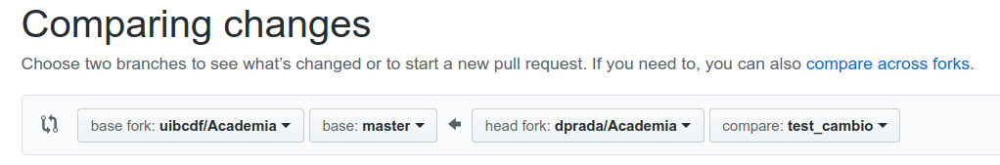

<div style='text-align: right;'> <a href="../README.md">Regresar</a> </div>

-----
<br>

<!-- <center></center> -->

<center></center>
<br>

# Cómo se usa UIBCDF-Academia.

<div class="alert alert-info" role="alert">
<strong>Info:</strong> Si crees que este notebook necesita algún cambio no dudes en <a href="../Como_contribuir/Como_contribuir.md" class="alert-link">contribuir a su desarrollo</a>.
</div>

<div class="alert alert-danger" role="alert">
<strong>En desarrollo:</strong> 90%.
</div>
 
<div class="alert alert-warning" role="alert">
<strong>Nota:</strong> Supondremos que estás usando como sistema operativo una distribución de Linux. Si no es tu caso, los notebooks anteriores y las referencias que encontrarás aquí pueden ayudarte a adaptar el proceso.
</div>

<br>

Este notebook es una guía de cómo comenzar a trabajar con este repositorio desde cero. Además, puede servirte como introducción en el uso de las herramientas que nos servirán para el trabajo científico en colaboración. Estos son los pasos propuestos con los que acabarás usando tu propia copia de Academia siendo capaz de proponer cambios:

- [El repositorio de UIBCDF-Academia en GitHub]()
- [Interactuando con UIBCDF-Academia en Binder]()
- [Interactuando con tu copia local de UIBCDF-Academia]()
   - [Configurando Git](#Configurando-Git)
   - [Configurando GitHub](#Configurando-GitHub)
   - [Creando el entorno de trabajo con Conda](#Creando-el-entorno-de-trabajo-con-Conda)
   - [El repositorio Academia](#El-repositorio-Academia)
      - [Si sólo quieres leerlo](#Si-sólo-quieres-leerlo)
      - [Si además quieres jugar con los notebooks en tu computadora](#Si-además-quieres-jugar-con-los-notebooks-en-tu-computadora)
      - [Si además quieres participar y no tienes permisos de edición](#Si-además-quieres-participar-y-no-tienes-permisos-de-edición)
      - [Si además quieres participar y tienes permisos de edición](#Si-además-quieres-participar-y-tienes-permisos-de-edición)
   - [Jugando con el repositorio y sus notebooks](#Jugando-con-el-repositorio-y-sus-notebooks)
      - [Leyendo y ejecutando los contenidos](#Leyendo-y-ejecutando-los-contenidos)
      - [Guardando cambios en tus notebooks](#Guardando-cambios-en-tus-notebooks)
      - [Cerrando Jupyter Lab](#Cerrando-Jupyter-Lab)
      - [Implementando cambios en el repositorio central](#Implementando-cambios-en-el-repositorio-central)
          - [Si no tienes permisos de edición](#Si-no-tienes-permisos-de-edición)    
          - [Si tienes permisos de edición](#Si-tienes-permisos-de-edición)

## El repositorio de UIBCDF-Academia en GitHub

## Interactuando con UIBCDF-Academia en Binder

https://mybinder.org/v2/gh/uibcdf/Academia/master?urlpath=lab

## Interactuando con tu copia local de UIBCDF-Academia

### Configurando Git

Es muy posible que Git ya esté instalado en tu sistema operativo. Si este no es el caso, puedes encontrar indicaciones para instalarlo en [la unidad de este repositorio a propósito de este controlador de versiones](Git.ipynb). No obstante, podemos recordar que en el caso de trabajar con la distribución de Ubunto de Linux, basta el comando:

```bash
sudo apt-get install git
```

Es muy recomendable que configures ahora las credenciales de tu usuario en Git para que tus commits estén bien identificados. Ejecuta en la terminal los siguientes comandos tecleando tu nombre y tu dirección de correo electrónico entre comillas:

```bash
git config user.name "Tu Nombre y Apellidos"
git config user.email "Tu dirección de email"
```

Si quieres puedes modificar el editor de textos (emacs, vim, nano, etc.) que Git disparará por defecto:

```bash
git config --global core.editor "vim"
```

Puedes ahora comprobar que el archivo de configuración de git de tu usuario tiene tus datos:

```bash
more ~/.gitconfig
```

#### Ayuda

En caso de que necesites más información, puedes visitar la unidad de [introducción a Git](Git.ipynb). Si has tenido algún problema técnico puedes compartirlo con nosotros en [el foro de Git del panel de este repositorio](https://github.com/uibcdf/Academia/issues/1), allí centralizamos los problemas y soluciones para que la experiencia se acumule de manera visible para todos.

## Configurando GitHub

Para hacer uso de este repositorio, y aprender con él, no es estrictamente necesario contar con una cuenta en GitHub. Si quieres participar de manera activa consultando o respondiendo dudas en el panel ("Issue board"), o quieres contribuir a su desarrollo implementando cambios, correcciones o material nuevo, tienes que disponer de una cuenta (el perfil de usuario ofrecido por GitHub sin coste es suficiente).

Abre la web [github.com](https://github.com/) y crea un usuario.

Ahora vamos a comunicarle a tu usuario de GitHub cuál es la o las máquinas desde las que vas a trabajar de manera remota. De esta manera podrás tirar y empujar cambios a tu computadora local de manera segura (mediante SSH). Para ello debes de seguir el guión descrito [aquí](https://help.github.com/articles/connecting-to-github-with-ssh/), que resumimos a continuación en el caso de que uses Linux (para Mac o Windows [aquí](https://help.github.com/articles/connecting-to-github-with-ssh/)).

SSH es un protocolo de comunicación encriptada entre computadoras. Seguramente conocerás el comando `ssh` si has tenido que acceder a otra máquina. En este caso nos vamos a valer del mecanismo que ssh tiene para, antes de pedir las credenciales de usuario (usuario y contraseña), reconocer que dos máquinas tienen su comunicación validada o si se desconocen: la clave de ssh. Un usuario de Linux puede generar su propia clave de ssh al margen de su password (repetimos que ésta funciona como mecanismo previo de autentificación). Vamos a ver si tienes dicha clave, o la tienes que generar:

```bash
ls -al ~/.ssh
```

Debes ver en el listado del contenido de fichero de tu carpeta `~/.ssh` que hay algún fichero llamado:

```bash
id_dsa.pub
id_ecdsa.pub
id_ed25519.pub
id_rsa.pub
```

En el caso de que no tengas ninguno de los anteriores, debes de crear tu clave haciendo uso de tu correo electrónico (el que registrate en GitHub por ejemplo) como etiqueta:

```bash
ssh-keygen -t rsa -b 4096 -C "your_email@example.com"
```

El comando anterior te pedirá, para generar y guardar la clave en un fichero, que proporciones la localización del nuevo fichero y una frase de seguridad (puedes dejar si quiere eso vacio):

```bash
Enter a file in which to save the key (/home/you/.ssh/id_rsa): [Press enter]
Enter passphrase (empty for no passphrase): [Type a passphrase]
Enter same passphrase again: [Type passphrase again]
```

Ya está la clave generada. Vamos a suponer que está en el fichero `~/.ssh/id_rsa.pub`, podemos verla:

```bash
more ~/.ssh/id_rsa.pub
```

Antes de comunicarle la clave a tu usuario de GitHub, vamos a incluirla en la lista de claves que el demonio de SSH de tu sistema operativo maneja:

```
eval "$(ssh-agent -s)"
ssh-add ~/.ssh/id_rsa
```

Vayamos ahora a tu sección de configuración de accesos remotos de tu página de GitHub. Dirígete para esto a tu menú 'Settings':

<center>

</center>

Y accede a la opción del menú lateral izquierdo 'SSH and GPG keys':

<center>

</center>

Haz click en el botón superior derecho de 'New SSH Key' y nombra la nueva clave con un título que recuerdes alusivo a la máquina que estás registrando ("mi laptop roja", p.ej.):

<center>

</center>

Ahora vuelve a tu terminal para copiar, fielmente, la clave y pegarla en la correspondiente caja de la configuración en GitHub de dicha clave. Para asegurar que la copia es fiel, podemos hacer uso de un comando como `xclip`. Instálalo si no lo tienes:

```bash
sudo apt-get install xclip
```

Ahora copia el contenido de tu clave ssh en memoria:

```bash
xclip -sel clip < ~/.ssh/id_rsa.pub
```

Vuelve a la web de configuración de claves y pega allí (con el botón derecho del ratón) la clave en la caja llamada "Key".

<center>

</center>

Ya puedes guardar el registro de tu clave en tu usuario de GitHub:

<center>

</center>

La validación de la conexión ya está hecha. Puedes probarla con el siguiente comando desde tu computadora. GitHub debe de devolverte un mensaje que incluya un saludo con tu nombre de usuario (de GitHub)

```bash
ssh -T git@github.com
# Si es la primera vez, debes confirmar 'yes' a la pregunta:
#Are you sure you want to continue connecting (yes/no)?
```

Si ves el mensaje de salida correctamente, ya puedes pasar a la siguiente sección:

```
Hi TuUsuarioGitHub! You've successfully authenticated, but GitHub does not provide shell access.
```

#### Ayuda

En caso de que necesites más información, puedes visitar la unidad de [introducción a GitHub](GitHub.ipynb). Si has tenido algún problema técnico puedes compartirlo con nosotros en [el foro de GitHub del panel de este repositorio](https://github.com/uibcdf/Academia/issues/3), allí centralizamos los problemas y soluciones para que la experiencia se acumule de manera visible para todos.

## Creando el entorno de trabajo con Conda

Es una buena práctica generar un entorno de python con Conda en el que instalar las librerías necesarias para desarrollar un determinado proyecto. En este caso vamos a crear un entorno que llamaremos `academia` que usaremos para instalar las librerías necesarias para hacer uso de este repositorio.

Antes de descargar Conda (Miniconda), vamos a crear una carpeta en la que alojaremos el gestor de entornos. Puedes hacerlo donde mejor te parezca, pero aquí vamos a recomendar instalar el software que instala y usa un usuario particular en un sistema Linux en algún sitio de su directorio principal. Por imitación con el directorio del sistema /opt, vamos a crear en nuestro `home` el directorio `~/Myopt` como lugar de instalación del software de terceros que sólo usaremos nosotros.

```bash
mkdir ~/Myopt
```

Dentro vamos a crear el directorio 'Miniconda':

```bash
mkdir ~/Myopt/Miniconda
```

Vamos ahora a descargar [el instalador que facilita Anaconda para miniconda](https://conda.io/miniconda.html). En el caso de este ejercicio vamos a descargar la versión de Linux 64 para Python 3, y lo haremos haciendo uso de la terminal. Puedes por tu cuenta, si quieres, descargar el instalador que prefieras y colocarlo donde hayas decidido, aquí lo pondremos en el directorio anterior:

```bash
cd ~/Myopt/Miniconda
wget https://repo.anaconda.com/miniconda/Miniconda3-latest-Linux-x86_64.sh
```

Como se sugiere en las [instrucciones de instalación](https://conda.io/docs/user-guide/install/index.html), ejectuamos ahora el script ahí donde lo descargamos.

```bash
bash Miniconda3-latest-Linux-x86_64.sh
```

El resto es seguir el proceso indicado por el instalador hasta el momento que pide indicar el lugar de instalación. En el caso de que estés siguiendo la pauta que aquí aconsejamos, escribiremos el nombre del nuevo directorio `miniconda3` en el camino (path) de la carpeta que hemos creado. En mi caso:

```bash
/home/diego/Myopt/Miniconda/miniconda3
```

Al final el instalador pide permiso para incluir en la lista de caminos donde el sistema y tu usuario buscará ejecutables, en tu fichero ~/.bashrc, el directorio donde instaló conda. Indicamos Si (yes) y listo.

Ahora, para comparar con lo que viene despues, ejecuta:

```bash
echo $PATH
```

Para que ver el efecto de la instalación tienes que abrir una nueva terminal (~/.bashrc se lee automaticamente en ese momento). En la nueva terminal repite el comando anterior:

```bash
echo $PATH
```

Tienes que notar que en la salida ya aparece el directorio `bin` del miniconda instalado. En mi caso, en la lista de caminos a directorios con ejecutables aparece:

```bash
/home/diego/Myopt/Miniconda/miniconda3/bin
```

Puedes ahora comprobar que tu usuario reconoce el comando `conda` comenzando a teclear la palabra y viendo si la tecla `tab` completa el comando, o ejecutando:

```bash
which conda
```

Actualizaremos ahora conda, antes de crear el entorno sobre el que trabajaremos:

```bash
conda update conda
```

Ya podemos crear el entorno de Python 3 que llamaremos `academia`:

```bash
conda create -n academia python=3
```

Comprueba pidiendole a conda que liste los entornos que has creado:

```
conda info --envs
```

Ya podemos cargar el entorno y comenzar a instalar librerías, pero antes, para que adviertas la diferencia, ejecuta:

```bash
which python
```

Seguramente ha aparecido como salida el python que por defecto usa tu sistema operativo: `/usr/bin/python`. Activemos ahora el entorno `academia` y comparemos:

```bash
source activate academia
```

Comprueba ahora qué python usarás si tecleas el comando `python`:

```bash
which python
```

Ya podemos instalar los paquetes con los que vamos a trabajar. Puedes, antes de nada, ver la lista de aquellos que fueron instalados en el momento de crear el entorno:

```bash
conda list
```

Instalaremos ahora el Jupyter Lab en nuestro entorno `academia`:

```bash
conda install -c conda-forge jupyterlab
```

Ahora podemos probar a abrirlo (se abrirá una nueva pestaña en tu navegador).

```bash
jupyter lab
```

Verás que como siempre que se ejecuta un programa que da salida por terminal, esta queda secuestrada. Tendrás que abrir una terminal nueva para seguir trabajando, o añadir `&` al final del comando:

```bash
jupyter lab &
```

Ya puedes si quieres, cerrar Jupyter Lab y desactivar el entorno `academia`.
Jupyter Lab se cierra desde el menú `File` de la barra superior de su ventana con la orden `Quit`. En ese momento la terminal que quedó secuestrada con los mensajes de salida y error de Jupyter, se libera. Puedes desactivar `academia` ahora:

```bash
source deactivate
```

#### Ayuda

En caso de que necesites más información, puedes visitar la unidad de [introducción a Conda](Conda.ipynb). Si has tenido algún problema técnico puedes compartirlo con nosotros en [el foro de Conda del panel de este repositorio](https://github.com/uibcdf/Academia/issues/6), allí centralizamos los problemas y soluciones para que la experiencia se acumule de manera visible para todos.

## El repositorio Academia

### Si sólo quieres leerlo

Si sólo quieres leer el contenido del repositorio, basta con que navegues por sus unidades haciendo uso del [documento introductorio `README.md` que puedes ver en el repositorio central](https://github.com/uibcdf/Academia/blob/master/README.md). GitHub permite visualizar el contenido de un Jupyter Notebook de una manera pasiva. Es por este motivo que intentaremos, en la medida de lo posible, guardar siempre las unidades en GitHub con la salida de la ejecución de sus celdas. Para que puedas verlos para consulta sin necesidad de operar con ellos.

Otro comentario pertinente es que si sólo quieres leer y actuar de manera pasiva, muy respetable, no era necesario la instalación de git, conda, la creación del usuario de GitHub, etc. Pero te aconsejamos que, para que el aprendizaje se parezca más a una experiencia de trabajo, decidas usar el repositorio al menos como se propone en la siguiente subsección.

### Si además quieres jugar con los notebooks en tu computadora

A caminar se aprende caminando. Es por eso que el formato que ofrece Jupyter Notebook para, entre otras cosas, desarrollar material didáctico, es idea. No sólo puedes leer el contenido de las unidades, si no que puedes ejectuar el código, modificarlo, introducir nuevas celdas para probar a crear tus nuevos ejemplos, etc. Es importante entonces que puedas ejecutar una copia de este repositorio en tu computadora. Tiene sentido entonces que hayas llegado hasta aquí en la lectura y realización de esta guía de uso.

Así, si solo quieres jugar con los notebooks, puedes descargar una copia local de varias maneras. En el directorio que desees, en mi caso en `~/Projects`, puedes por ejemplo clonar el repositorio así:

```bash
cd ~/Projects
git clone https://github.com/uibcdf/Academia.git
```

Si no tienes pensado participar en la edición del repositorio, puedes saltar las siguientes subsecciones y seguir en [Jugando con el repositorio Academia y sus notebooks](#Jugando-con-el-repositorio-Academia-y-sus-notebooks).

### Si además quieres participar y no tienes permisos de edición

Sería muy positivo para el repositorio que nos ayudaras a corregirlo o a mejorarlo incluyendo aquellas cuestiones que has echado de menos. Si no tienes mucha experiencia en el trabajo en colaboración, puedes tomarte este repositorio como una primera experiencia que te ayudará a entender las herramientas y la dinámica de desarrollo de un proyecto en grupo. Para ello, crea tu propio 'fork' del repositorio en tu usuario de GitHub. Espera, si no sabes qué es un 'fork' y cúal es la diferencia con un clon puedes encontrar más información [aquí](https://help.github.com/articles/fork-a-repo/), [aquí](https://github.community/t5/Support-Protips/The-difference-between-forking-and-cloning-a-repository/ba-p/1372) o [aquí](https://stackoverflow.com/questions/6286571/are-git-forks-actually-git-clones) o [aquí](http://www.eqqon.com/index.php/Collaborative_Github_Workflow). Para hacer tu fork acude a la web de Academia en GitHub y haz click en 'fork'.

<br>
<center>

</center>
<br>

Ya puedes acudir a tu página de GitHub y encontrar Academia entre tus repositorios. Ahora, para hacer un clon local de tu fork de Academia. Sustituye en el siguiente comando 'tu-nombre' por tu nombre de usuario en GitHub, y ejecútalo en el directorio en el que quieras ubicarlo, en mi caso mi carpeta '~/Projects':

```bash
cd ~/Projects
git clone git@github.com:tu-nombre/Academia.git
```

Tu 'fork' de Academia, y su clon local en tu computadora, te van a permitir jugar y cambiar cosas sin alterar el repositorio central. Puedes hacer lo que quieras en ellos. Una buena manera de proceder sería, como verás en la subsección [Jugando con el repositorio Academia y sus notebooks](#Jugando-con-el-repositorio-Academia-y-sus-notebooks), dejar el master de tu 'fork' como espejo del repositorio central y crear ramas ('branches') para jugar o para proponer modificaciones y solicitar 'Pull Requests' de tus contribuciones (lo verás más adelante).

### Si además quieres participar y tienes permisos de edición

Si tienes permisos de edición en [el repositorio central de Academia](http://github.com/uibcdf/Academia) y no tienes mucha experiencia, crear tu propio 'fork' como se describe en la subsección anterior puede ser muy buena idea. Esto te va a permitir jugar sin miedo con tus propias copias del repositorio y aun así, como verás más adelante, puedes proponer modificaciones e implementar cosas a través de 'Pull Requests' desde tu usuario.

De todas formas, si hay algún motivo por el cual, teniendo permiso, es más cómodo para ti implementar cambios directamente en el repositorio central, puedes hacer tu clon local en el directorio de tu computadora que desees (en mi caso en '~/Projects'):

```bash
cd ~/Projects
git clone git@github.com:uibcdf/Academia
```

Si no tienes claro cuál es la diferencia entre clon y fork, puedes encontrar un poco de orientación [aquí](https://help.github.com/articles/fork-a-repo/), [aquí](https://help.github.com/articles/cloning-a-repository/), [aquí](https://github.community/t5/Support-Protips/The-difference-between-forking-and-cloning-a-repository/ba-p/1372), [aquí](https://stackoverflow.com/questions/6286571/are-git-forks-actually-git-clones) o [aquí](http://www.eqqon.com/index.php/Collaborative_Github_Workflow).

#### Ayuda

En caso de que necesites más información, puedes visitar la unidad de [introducción a GitHub](GitHub.ipynb). Si has tenido algún problema técnico puedes compartirlo con nosotros en [el foro de GitHub del panel de este repositorio](https://github.com/uibcdf/Academia/issues/3), allí centralizamos los problemas y soluciones para que la experiencia se acumule de manera visible para todos.

## Jugando con el repositorio y sus notebooks

El material del repositorio está diseñado para ser enteramente reproducible en Jupyter Lab. Así que activemos el entorno para academia, si no está ya activado y ejecutemos el Jupyter Lab que allí hemos instalado.

```bash
source activate academia
cd ~/Projects/Academia
jupyter lab
```

Ha debido abrirse tu navegador, o una nueva pestaña en la ventana que ya tenías del navegador, con Jupyter Lab.

### Leyendo y ejecutando los contenidos

El mismo contenido que aparecía en el [repositorio de GitHub](https://github.com/uibcdf/Academia), y que aparece en la carpeta de tu clon local,

```bash
ls ~/Projects/Academia
```

Es el que aparece en el explorador de ficheros de la ventana lateral izquierda (la puedes hacer aparecer y desaparecer haciendo click en el icono de folder gris):

<br>
<center>

</center>
<br>

Verás que en el explorador aparece el fichero `README.md`. Este es el documento introductorio con tabla de contenidos. Se trata de un fichero de texto plano con sintaxis Markdown. Puedes abrirlo haciendo doble click sobre el y verás el fichero en crudo. Si quieres editarlo, es así como puedes hacerlo. Ahora, si sólo lo queremos visualizarlo, haz click con el botón derecho sobre su `README.md` y selecciona `Open with > Markdown Preview`. 

<br>
<center>

</center>
<br>

Aparecerá una pestaña nueva con el texto interpretado que usaremos como base para navegar por el repositorio:

<br>
<center>

</center>
<br>

Desciende en ese fichero hasta la tabla de contenidos:

<br>
<center>

</center>
<br>

Haz un sólo click con el botón izquierdo sobre el título de la unidad que quieres ver, por ejemplo la que dice "· Programando en Python". Se abrirá el correspondiente Jupyter Notebook con el que podrás jugar de manera local, ya que es una versión situada en tu computadora.

Para comenzar a interaccionar con el notebook, ya que probablemente fue guardado con la salida de la ejecución de sus celdas para poder seguirse en GitHub, reinicia el nucleo (kernel) y borra las salidas:

<br>
<center>

</center>
<br>

Ya puedes ejecutar sus celdas con la combinación de teclas 'mayús'+'entrar', modificarlo, añadir nuevas celdas, en definitiva, jugar con él.

## Guardando cambios en tus notebooks

Jupyter Lab guarda cada poco tiempo los documentos abiertos (notebooks, ficheros de texto, etc.). Puedes activar o desactivar esta opción en el menú superior:

<br>
<center>

</center>
<br>

No obstante, puedes decidir guardar los cambios haciendo uso del icono conforma de floppy (nadie los usa ya, pero el icono no pasa de moda):

<br>
<center>

</center>
<br>

Si por el contrario, estás editando un fichero de texto como por ejemplo el 'README.md'. Tendrás que ir al menú 'File > Save Markdown File':

<br>
<center>

</center>
<br>

**Nota**: Si quieres proponer cambios en un notebook, asegurate de guardarlo con todas las celdas ejecutadas en su orden cronológico para poder servirlo así en el repositorio central. Si es necesario, toma la precaución de reiniciarlo borrando las salidas para volver a ejecutarlo de principio a fin antes de guardarlo.

## Cerrando Jupyter Lab

Los notebooks de Jupyter, al igual que iPython, necesitan cada uno de ellos un kernel corriendo detrás, como un cerebro que interpreta el notebook y al que le pides que ejecute las celdas y ofrezca su resultado como salida. Puedes guardar si quieres todos los notebooks y documentos que has estado editando, pero recuerda que esto no apaga los kernels. Para ello, antes de cerrar Jupyter Lab, recuerda que hay una sección, a la que puedes acceder clickando en el monito corriendo del menú lateral izquierdo, en el que puedes ver qué kernels están corriendo para cerrarlos:

<br>
<center>

</center>
<br>

Ya puedes cerrar Jupyter en el menú 'File > Quit':

<br>
<center>

</center>
<br>

#### Ayuda

En caso de que necesites más información sobre el uso de Jupyter Lab, puedes visitar la unidad de [introducción a Jupyter](Jupyter.ipynb). Si has tenido algún problema técnico puedes compartirlo con nosotros en [el foro de Jupyter del panel de este repositorio](https://github.com/uibcdf/Academia/issues/7), allí centralizamos los problemas y soluciones para que la experiencia se acumule de manera visible para todos.

## Implementando cambios en el repositorio central

Supongamos que has detectado un error y lo quieres corregir, o consideras que la explicación no es clara, quieres añadir un párrafo, o conoces documentación o tutoriales que quieres compartir en la lista del final de un notebook. Edita lo que quieras en el notebook y cuando consideres que está listo reinicialo y ejecútalo de principio a fin. Despúes compromete los cambios y haz un 'Pull Request' (PR en la jerga de Git). Veamos esto paso a paso.

### Si no tienes permisos de edición

En este caso lo más probable es que hayas decidido hacer tu propio fork del repositorio. En ese caso puedes recurrir a la página web de github de tu fork, o puedes solicitar el 'Pull Request' haciendo uso de la [web del repositorio de academia](https://github.com/uibcdf/Academia).

Antes, asegurate de ciertas cosas. Si has estado jugando con tu fork de Academia necesitamos que los cambios relativos a tus pruebas de aprendizaje no estén entre la lista de modificaciones que vas a compartir. Es muy conveniente que hayas estado jugando en una rama creada para tal propósito, o que si has estado modificando 'master' deshagas los cambios que no quieres compartir. Si tienes el 'master' limpio y actualizado, te sugerimos que hagas una nueva rama y la empujes a tu fork central de GitHub.

Con el `master` del clon local de tu fork limpio crea una rama para tu modificación o modificaciones:

```bash
git checkout -b nombre_de_la_rama # usa un nombre que la identifique
```

Ahora empuja tu rama a tu repositorio del fork:

```bash
git push origin nombre_de_la_rama
```

Ya puedes en local hacer los cambios que quieres subir y comprometerlos en esa rama:

```bash
git commit -a -m 'descripción breve de cambios'
git push origin nombre_de_la_rama
```

Para despues hacer el 'Pull Request' haciendo uso de la [web del repositorio de academia](https://github.com/uibcdf/Academia). Haz click en 'New Pull Request':


<br>
<center>

</center>
<br>

Haz click entonces la opción 'compare across forks' en el botón derecho para su comparación con el `master`, y elige tu repositorio y la rama que quieres fusionar con el `master` del repositorio original de Academia:

<br>
<center>

</center>
<br>

Documenta tu PR dando un poco de información sobre los cambios que has realizado para que podamos discutir su aceptación. Tu solicitud será revisada y evaluada por todos su aprobación.

Puedes tener un poco más información sobre este proceso [aquí](https://help.github.com/articles/creating-a-pull-request/).

### Si tienes permisos de edición

En este caso, si optaste por hacer un 'fork' del repositorio central en tu usuario, la sección anterior describe el procedimiento más adecuado para hacer un 'Pull Request' (PR en la jerga de Git).

Si en lugar de eso hiciste un clon del repositorio de Academia en el grupo UIBCDF de Github y has estado jugando con tu clon local necesitamos que los cambios relativos a tus pruebas no estén entre la lista de modificaciones que vas a compartir. Deshaz los cambios, pídele a git que vuelva a la versión original, o directamente haz un nuevo clon donde tu quieras:

```bash
cd ~/Projects/
git clone git@github.com:uibcdf/Academia Academia_limpia
cd Academia_limpia
```

Con el clon limpio crea una rama para tu modificación o modificaciones:

```bash
git checkout -b nombre_de_la_rama # usa un nombre que la identifique
```

Ahora empuja tu rama al repositorio central:

```bash
git push origin nombre_de_la_rama
```

Ya puedes en local hacer los cambios que quieres subir y comprometerlos en esa rama:

```bash
git commit -a -m 'descripción breve de cambios'
git push origin nombre_de_la_rama
```

Para despues hacer el 'Pull Request' haciendo uso de la [web del repositorio de academia](https://github.com/uibcdf/Academia). Haz click en 'New Pull Request':


<br>
<center>

</center>
<br>

Elige entonces tu rama en el botón derecho para su comparación con el `master`:

<br>
<center>

</center>
<br>

Documenta tu PR dando un poco de información sobre los cambios que has realizado, para su aceptación.
Tu solicitud será vista y discutida por todos hasta su aprobación.

Puedes tener un poco más información sobre este proceso [aquí](https://yangsu.github.io/pull-request-tutorial/) o [aquí](https://help.github.com/articles/creating-a-pull-request/).

#### Ayuda

En caso de que necesites más información a propósito de cómo implementar cambios o interaccionar con el repositorio remoto, puedes visitar la unidad de [introducción a GitHub](GitHub.ipynb). Si has tenido algún problema técnico puedes compartirlo con nosotros en [el foro de GitHub del panel de este repositorio](https://github.com/uibcdf/Academia/issues/3), allí centralizamos los problemas y soluciones para que la experiencia se acumule de manera visible para todos.

<br />

-------
<p xmlns:cc="http://creativecommons.org/ns#" xmlns:dct="http://purl.org/dc/terms/"><a property="dct:title" rel="cc:attributionURL" href="https://github.com/uibcdf/Academia">UIBCDF-Academia</a> por <a rel="cc:attributionURL dct:creator" property="cc:attributionName" href="https://github.com/uibcdf/Academia/graphs/contributors">UIBCDF Lab, autores y colaboradores</a> es material protegido bajo una licencia <a href="http://creativecommons.org/licenses/by-nc-sa/4.0/deed.es?ref=chooser-v1" target="_blank" rel="license noopener noreferrer" style="display:inline-block;">Attribution-NonCommercial-ShareAlike 4.0 International</a></p>

